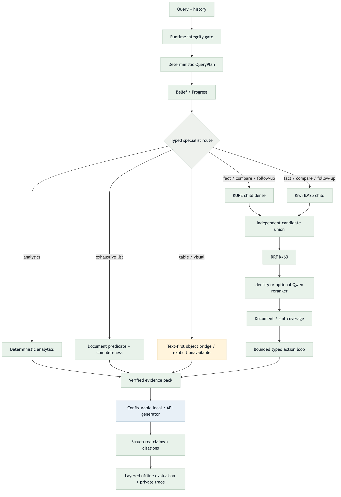
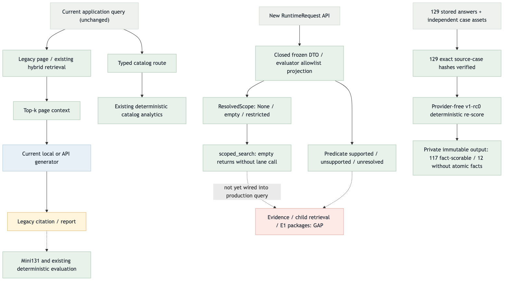

# BidFit Evidence-Harness v1-rc0 흐름 검증

## Target Flow

## Current Implementation Flow — Phase 0

## Color Semantics

- green: 현재 서버/로컬이 소유하고 검증할 정상 경로
- blue: 교체 가능한 API/모델 provider 경로
- amber: 조건부 또는 compatibility 경로
- red: 시작 시점의 명시적 결손/안전 gap
- gray: route 또는 control helper

## Target vs Current Gap

| Target node/edge | 시작 상태 | 영향 | 분류 |
| --- | --- | --- | --- |
| runtime integrity gate | frozen DTO/projection/scope/predicate 구현·검증 | production query 연결은 Evidence/E1 이후 | PARTIAL |
| immutable EvidenceStore | 현재 checkout에 패키지 부재 | 구조화된 provenance/citation 기준점 없음 | GAP |
| independent child dense + Kiwi BM25 | 기존 page/index 중심 | child granularity rescue 및 독립 fusion 불가 | GAP |
| RRF + coverage + reranker | 일부 기존 fusion만 존재 | query-type budget/문서 다양성 미보장 | GAP |
| Belief/Progress bounded loop | production 패키지 부재 | compare/follow-up 근거 누락 추적 불가 | GAP |
| Analytics/List specialist lanes | catalog analytics 일부만 존재 | complete receipt와 통합 provenance 부족 | PARTIAL |
| structured claim citations | legacy response 중심 | claim→evidence resolution hard gate 부족 | GAP |
| visual lane | occurrence/crop/OCR 계약은 존재 | full VLM 제외, conditional bridge만 허용 | INTENTIONAL_SERVER_CONTROL_EXCEPTION |

## Done / Not Done Priority

점수는 `upstream_weight + connection_value + safety_value + validation_value + risk_penalty`다.

| 후보 | 상태 | U | C | S | V | R | 점수 | 다음 행동 |
| --- | --- | ---: | ---: | ---: | ---: | ---: | ---: | --- |
| P0 integrity + fail-closed scope | IMPLEMENTED / wiring pending | 4 | 3 | 2 | 2 | 0 | 11 | EH2에서 실제 QueryPlan 통합 검증 |
| EvidenceStore + child retrieval + RRF | NOT DONE | 3 | 3 | 1 | 2 | -1 | 8 | P0 다음 foundation |
| E1 QueryPlan + Belief/Progress | NOT DONE | 3 | 3 | 1 | 2 | -2 | 7 | retrieval 위에 연결 |
| Analytics/List/Table specialist | PARTIAL | 2 | 2 | 1 | 2 | -1 | 6 | state loop 뒤 연결 |
| identity/Qwen adapter + layered eval | PARTIAL | 1 | 2 | 1 | 2 | -1 | 5 | 마지막 A/B 계약 |

## Scoring Criteria

- U: 상류 노드일수록 높음(0–4)
- C: 닫히는 downstream 연결 수(0–3)
- S: 무결성·보안 효과(0–2)
- V: 작은 테스트로 검증 가능한 정도(0–2)
- R: 변경 폭/데이터 위험 패널티(0~-3)

## Validation

- 시작 audit: `feature/visual-retrieval`, HEAD `7ad229f`, dirty 변경 보존
- target/current PNG 및 HTML은 구현 전 렌더하고, 구현·테스트 후 current와 표를 다시 갱신한다.
- 시작 판정: `GAP`; 최우선 relay unit은 P0 integrity다.

### Phase 0 실행 증거 (2026-09-03)

- 최종 focused 47 tests PASS; 전체 852 tests / 32.147s / OK / skip 0 (기존 805+신규 47).
- 실제 저장 답변 129건을 provider 호출 0회로 재채점. case join/hash 129/129.
- atomic facts가 있는 117건만 fact coverage 계산. 나머지 12건은 unavailable 분모이며 1점으로 처리하지 않음.
- 새 생성/검색 품질 비교나 성능 향상 측정은 아니다. legacy 앱 경로는 그대로다.
- 다음 구현 가능한 upstream dependency: EH1.1 Evidence 타입, score 8.
- 판정: `GAP/PARTIAL`. P0 standalone 코드를 전체 runtime 통합 완료로 표기하지 않는다.
- Playwright: PNG2/표1/page errors0, desktop screenshot과 mobile overflow0 PASS.
  `../../test/playwright-screenshots/eh-rc0-phase0-2026-09-03.png`.
