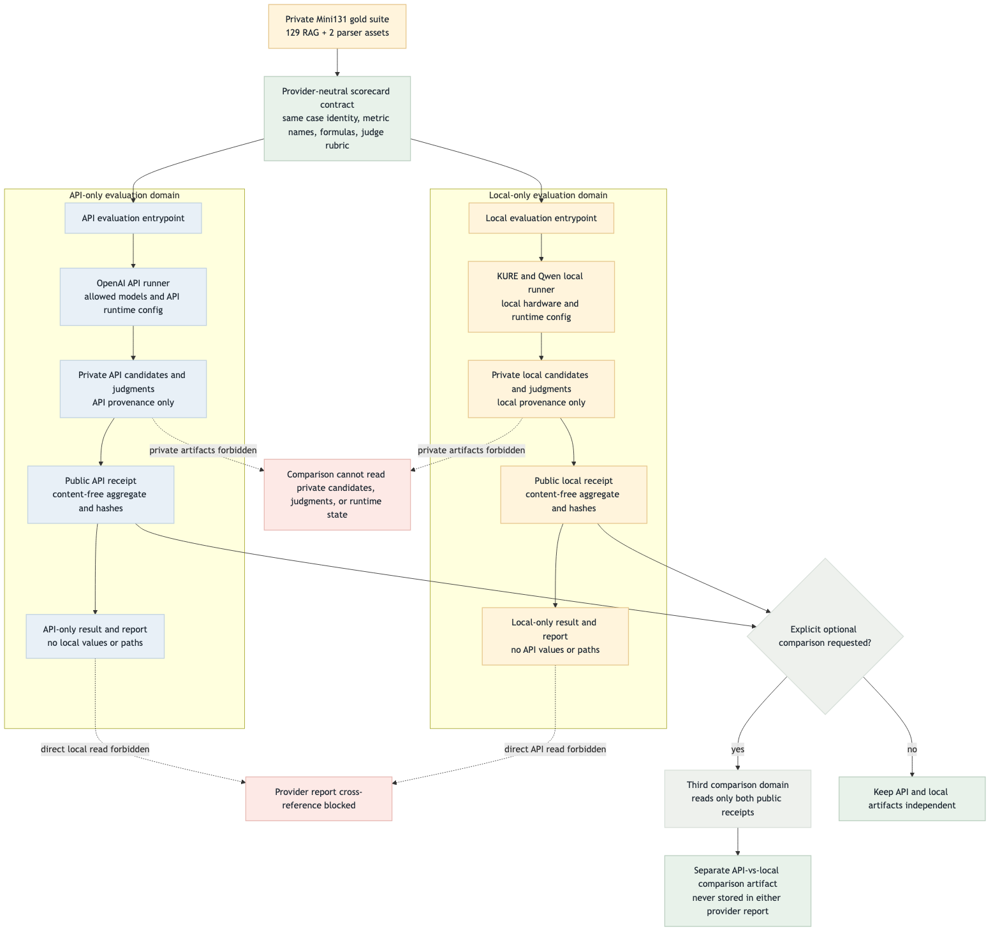
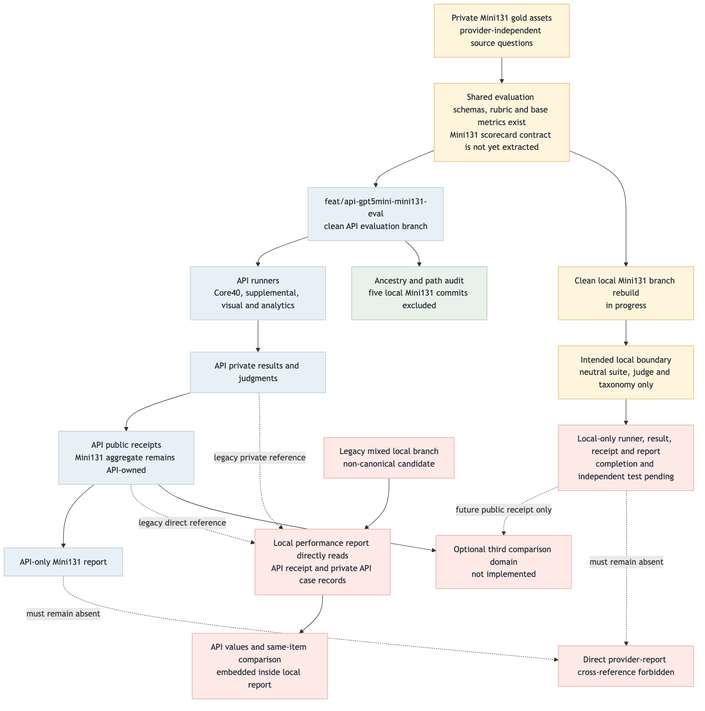

# API / Local evaluation provider boundary validation

최종 갱신: 2026-09-01

상태: **PARTIAL — API CLEAN / LOCAL CLEAN IN PROGRESS / LEGACY MIXED NON-CANONICAL**

## 판정 요약

API와 로컬 평가가 공유해야 하는 것은 Mini131의 case identity, metric key, 산식, judge rubric,
taxonomy뿐이다. 실행기, provider 설정, private 후보·판정, 공개 receipt, 결과 JSON과 HTML 보고서는
provider별로 각각 소유해야 한다. API 보고서가 로컬 결과를 읽거나 로컬 보고서가 API 결과를 읽는
직접 참조는 금지한다.

비교가 필요할 때만 제3의 optional comparison 영역을 실행한다. 이 영역은 API와 로컬의
content-free public receipt 두 개만 읽고, 비교 결과도 provider 보고서 밖의 별도 artifact로 쓴다.
private candidate, judgment, transcript, runtime checkpoint를 비교 입력으로 사용하지 않는다.

현재 clean API 브랜치는 이 경계를 만족한다. 반면 기존 mixed 로컬 브랜치는 API receipt와 private
API case ledger를 직접 읽어 API 수치와 same-item 비교를 로컬 보고서에 넣으므로 canonical 경로가
될 수 없다. clean local 브랜치 재구성과 Mini131 scorecard contract의 provider-neutral 추출은 진행
중이며, 완료 전 전체 정렬 상태는 `PARTIAL`이다.

## Target Flow

- Mermaid source: [evaluation-provider-boundary-target-flow.mmd](evaluation-provider-boundary-target-flow.mmd)
- PNG: [evaluation-provider-boundary-target-flow.png](evaluation-provider-boundary-target-flow.png)

## Current Implementation Flow

- Mermaid source: [evaluation-provider-boundary-current-flow.mmd](evaluation-provider-boundary-current-flow.mmd)
- PNG: [evaluation-provider-boundary-current-flow.png](evaluation-provider-boundary-current-flow.png)

## Target vs Current Gap

| ID | Target | Current evidence | Status | Catch-up proof |
| --- | --- | --- | --- | --- |
| B1 | API runner/result/receipt/report는 API 전용 | clean API 브랜치가 로컬 Mini131 커밋 5개를 ancestry에서 제외했고 로컬 전용 diff가 없다 | MATCHED | API focused/full tests와 branch audit 유지 |
| B2 | Mini131 scorecard는 provider-neutral pure contract | base schema/rubric/metrics는 있으나 Mini131 judge·taxonomy·score helper가 API assembly/report 모듈과 결합 | GAP | pure module로 keyset/formula/judge/taxonomy 추출 후 양쪽 contract test |
| B3 | Local runner/result/receipt/report는 local 전용 | clean local 재구성 진행 중; 목표 import는 neutral suite/judge/taxonomy로 제한 | IN PROGRESS | API path·receipt·private ledger 참조 0건과 local-only report 테스트 |
| B4 | provider 보고서 간 직접 참조 금지 | legacy mixed 로컬 보고서가 API public receipt와 private API ledger를 직접 읽음 | GAP / LEGACY | mixed 브랜치를 non-canonical로 표시하고 clean local을 새 canonical로 지정 |
| B5 | 비교는 별도 제3영역에서 public receipt만 사용 | 별도 comparison runner/report 없음 | OPTIONAL GAP | public receipt schema·hash만 입력으로 받는 독립 artifact |
| B6 | 경계 위반을 CI에서 자동 차단 | stack import boundary test는 있으나 evaluation provider I/O·report 경계 전용 검사는 없음 | GAP | forbidden import/path/receipt field 정적 테스트 추가 |

## Done / Not Done Priority

점수는 `upstream_weight(0–4) + isolation_value(0–4) + validation_value(0–2) +
delivery_value(0–2) + risk_penalty(0~-3)`로 계산한다. 높은 미완료 점수부터 다음 릴레이 단위로
선택한다.

| Rank | Unit | Status | U | I | V | D | R | Score | Next action |
| ---: | --- | --- | ---: | ---: | ---: | ---: | ---: | ---: | --- |
| 1 | clean API-only branch | DONE | 4 | 4 | 2 | 2 | 0 | 12 | branch를 API canonical candidate로 유지 |
| 2 | provider-neutral Mini131 scorecard extraction | NOT DONE | 4 | 4 | 2 | 2 | 0 | pure contract module과 양 provider parity test 작성 |
| 3 | clean local-only runner/result/report | IN PROGRESS | 4 | 4 | 2 | 2 | -1 | API receipt·private ledger·비교 필드 제거 후 독립 실행 |
| 4 | evaluation provider boundary CI guard | NOT DONE | 3 | 4 | 2 | 1 | 0 | import/path/report schema 금지 규칙 자동화 |
| 5 | legacy mixed branch non-canonical marker | NOT DONE | 2 | 4 | 1 | 1 | 0 | README/운영 문서에서 교체 브랜치와 금지 경로 명시 |
| 6 | optional public-receipt comparison domain | NOT DONE / OPTIONAL | 1 | 2 | 1 | 2 | -2 | 양 provider 완료 뒤 별도 브랜치·경로로만 구현 |

현재 다음 릴레이 우선순위는 score 12의 provider-neutral scorecard extraction이다. 이 계약이 먼저
고정돼야 clean local이 API 모듈을 재사용하지 않고도 동일 항목·동일 산식으로 평가될 수 있다.

## Scoring Criteria

| Criterion | Range | Meaning |
| --- | ---: | --- |
| Upstream weight | 0–4 | 다른 실행·평가·보고서가 이 단위에 얼마나 의존하는가 |
| Isolation value | 0–4 | provider·private data·runtime 경계를 얼마나 직접 보호하는가 |
| Validation value | 0–2 | 회귀를 자동으로 검출하고 재현 가능한가 |
| Delivery value | 0–2 | 팀이 독립 결과를 읽고 실행할 수 있게 하는가 |
| Risk penalty | 0~-3 | private artifact 결합, 결과 재작성, 비교 오해 가능성 |

## Color Semantics

- **green**: repository-owned, validated, normal contract/control path
- **blue**: API/external provider-owned execution and artifacts
- **amber**: local-first, private input, review, or work-in-progress path
- **red**: blocked, forbidden cross-reference, legacy mixing, or implementation gap
- **gray**: branch, decision, or optional comparison helper

## Validation

### Branch and code boundary

- clean API branch: `feat/api-gpt5mini-mini131-eval`
- API branch HEAD at report creation: `514e5d2cfb5d97d60da58d7f0f62ae893f8e1666`
- excluded local Mini131 ancestry: `81c6c26`, `d84937d`, `2289521`, `0fe9f2f`,
  `7ad229f` — all `EXCLUDED`
- API branch diff local-only path/token matches: `0`
- API stack tests: `23/23 PASS`
- API matrix + stack boundary: `15/15 PASS`
- evaluation tests: `177/177 PASS`, private fixture `8 SKIP`
- repository tests: `568/568 PASS`, private fixture `8 SKIP`
- `git diff --check`: PASS

### Diagram and HTML render

- `mmdc 11.15.0` target/current render: PASS
- target PNG: `1568 × 1476`, current PNG: `1568 × 1580`
- headless Chromium DOM/render check: PASS
- required headings: `7/7` visible
- images: `2/2` loaded with nonzero natural dimensions
- color legend: visible; gap rows `6`; priority rows `6`; scoring rows `5`
- horizontal overflow: `false`; page errors: `0`
- screenshot: `1440 × 4266`
  `fivecircles/test/playwright-screenshots/evaluation-provider-boundary-validation.png`

## Completion Gate

다음 조건을 모두 만족해야 전체 provider boundary를 `MATCHED`로 바꾼다.

1. clean local branch가 local-only receipt와 report를 생성하고 API 경로 참조 0건을 증명한다.
2. 공통 Mini131 contract가 순수 judge/taxonomy/scorecard keyset·formula만 노출한다.
3. API와 local 양쪽이 동일 contract test를 통과하되 실행·I/O·결과·HTML은 서로 import하지 않는다.
4. legacy mixed branch가 canonical이 아님을 문서와 branch handoff에 명시한다.
5. Mermaid PNG 두 개와 HTML이 실제 browser render에서 정상이며 screenshot 증거가 저장된다.

Optional comparison은 이 완료 gate의 필수 조건이 아니다. 구현할 경우 두 public receipt만 읽는 제3영역
계약을 별도로 검증한다.
