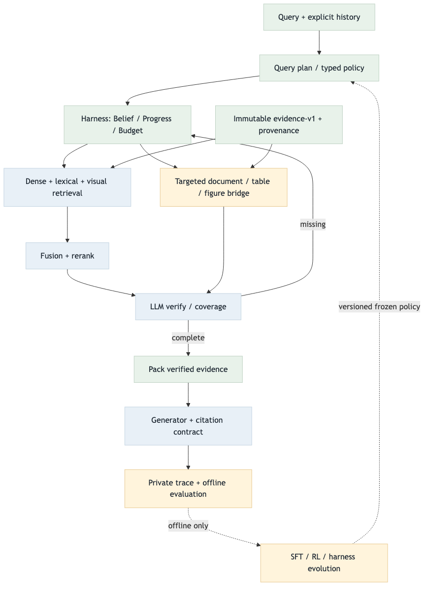
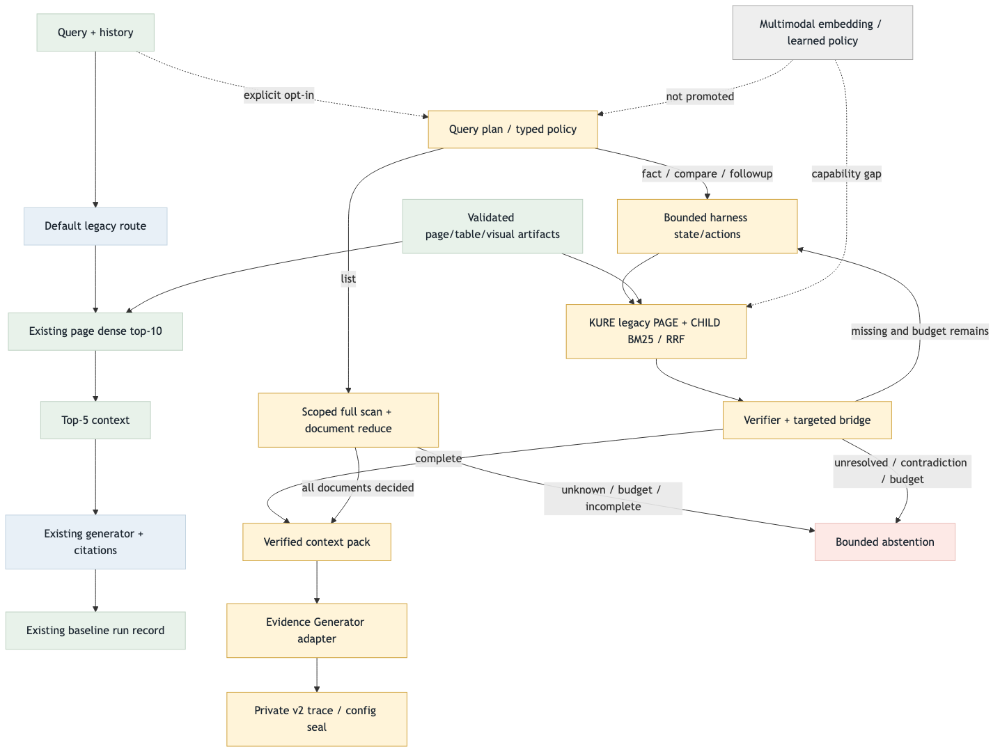

# Evidence-Harness Target / Current

2026-09-02 · EH1–EH10 · NONVISUAL IMPLEMENTED / FACT·LIST·CORPUS LIVE PASS / PROMOTION GAP

[HTML 보고서](../../work/evidence-harness-report.html) · [로컬 실행 runbook](../../work/evidence-harness-local-runbook.md) · [계약](evidence-harness-contract.md)

## Target / current diagrams

[Target Mermaid](evidence-harness-target-flow.mmd) · [Current Mermaid](evidence-harness-current-flow.mmd)

Target/current PNG를 모두 생성하고 이미지를 확인했다. HTML 로컬 파일 열기는 브라우저 정책으로 차단되었다.
정적 링크·이미지 경로 검증과 PNG 확인만 수행했으며 브라우저 렌더 통과로 표시하지 않는다.

## 현재 연결

- 실제 store: 98문서, 9,331 page + 9,513 text = 18,844 Evidence. 현재 corpus 연결은 구조화 표·그림을 새로 복원하지 않는다.
- 검색: 기존 KURE page-part 벡터 9,331×1,024 + child BM25 → RRF k=60. 새 child dense embedding이 아니다.
- KURE query embedding은 CPU에서 수행한다. 모델·corpus·index provenance를 검증한 기존 artifact를 재사용한다.
- reranker는 Identity/no-op. planner/policy/verifier/generator는 pinned Mac `qwen3.8:27b-mlx`; policy는 미학습이다.
- fact/compare/followup: 계획 → 상태/행동 → 검색·bridge → LLM 검증 → 필수 근거 보존 → 생성.
- list: scoped 문서별 bounded scan/reduce → 전체 판정 완료 확인 → 근거 패킹·생성. unknown·예산 초과는 incomplete다.
- v2 trace: `config={harness,runtime}` 전체 seal에 retrieval provenance·모델·예산·visual capability를 포함한다. v1 호환 유지.
- EH6 exporter와 evolution seal gate는 준비 완료. SFT/RL 학습·reward 생성·학습 정책 승격은 미실행이다.
  list receipt는 action snapshot이 없어 `list_trajectory_not_trainable`로 학습 export를 거부한다.

## 연결별 검증과 격차

| Node / edge | Status | 확인 근거 | 남은 일 / 우선순위 |
| --- | --- | --- | --- |
| source-bound Evidence → KURE page / child BM25 | LIVE PASS | 실제 98문서 artifact와 store 구성 확인, 실제 corpus 답변 성공 | 고정 골든셋 품질 비교 / P1 |
| search → RRF → reranker guard | VALIDATED | scope·unknown ID·순위 경계 검사 | learned reranker 품질 비교 / P2 |
| plan → state → action → LLM verify | LIVE PASS / LATENCY GAP | 실제 corpus Harness READY·5 actions, 두 속성 답변 확인 | verifier 53.440초·58.422초 지연 개선 / P1 |
| scoped list → scan / reduce → completeness | SMALL LIVE PASS | 합성 3문서 전체 검사, 일치 2건·인용 2개, 실제 모델 8회 호출 | 98문서 목록 품질·지연 실측 / P1 |
| retained pack → generator / operational error | LIVE PASS | 실제 corpus required/context 1개·페이지 인용 1개로 생성 성공. 오류/기권 회귀 통과 | 동일 기준 다문항 품질 검증 / P1 |
| runtime → private v2 trace → exporter | VALIDATED PREPARATION | composite seal·v1 호환·변조 거부·list 학습 제외 검사 | 승인 train/heldout 및 실제 학습·평가 / P1 |
| learned policy / learned reranker / GCP runtime | GAP | policy 미학습; 실제 Mac 27B와 GCP 8B 목표 구분 | artifact 확인과 별도 실험 / P2 |
| multimodal embedding / visual reader | DEFERRED CAPABILITY GAP | visual 안전 기권, 명시적 object bridge 계약 유지 | checkpoint·reader·pixel fidelity 준비 후 연결 / P2 |
| fixed gold / judge / resources → promotion | GAP | 이번 실행에 의미 품질·향상 점수 없음 | 동일 기준 품질/지연 비교 후 승격 판단 / P1 |

우선순위: P0=현재 로컬 경로 마감에 필요한 검증, P1=학습·승격의 후속 조건, P2=별도 artifact·환경이 필요한 확장.
이는 작업 우선순위이며 품질·정확도 점수가 아니다.

색상: 초록=기존 검증 경로, 파랑=모델/provider 경계, 호박=opt-in/private/조건부 경로,
빨강=기권·미지원, 회색=미연결 확장. 다이어그램은 코드 연결을 나타내며 전체 corpus 실행 성공이나 학습 완료를 의미하지 않는다.

## 검증 증거

- 전체 테스트 938개 실행: 920 PASS, 18 private-artifact skip, 실패·오류 0. 실행 12.018초, compile PASS.
- 기존 evaluation import/private fixture 오류는 해결했다. 합성 계약 검사는 유지하고 private 통합 의존만 skip한다.
- Repository safety: 최근 620파일 검사 PASS.
- Target/current PNG 생성·이미지 확인 완료. 브라우저 file 정책으로 HTML 렌더 검증은 차단되었다.
- 오류·해결 기록: [전체 테스트 로그](../../test/errorlogs/2026-09-02-evidence-harness-full-suite.md) · [실호출 분류·예산](../../test/errorlogs/backend/2026-09-02-harness-live-routing-budget.md).

| 실제 실행 | 상태 | 관측 결과 |
| --- | --- | --- |
| 합성 fact / 실제 Mac 모델 | PASS | 계획·검증·생성 성공. Trace SHA-256 `f5c57d8c412b0fbe3c102a4e259b5b3464d1f9ccc760b88e6f1c3416b58a9466` |
| 실제 corpus 후속 질문 | PASS | Harness READY·5 actions → answered, 두 요청 속성 답변·required/context 1개·페이지 인용 1개. Trace SHA-256 `6c9827def5955e46c53463165c326aa1991487f4b8f70bf46cdec9f255a4cdeb` |
| 합성 목록 / 실제 Mac 모델 | PASS | 3/3문서 검사·일치 2건·인용 2개. enumerate 6회 + planner/answer 각 1회 = 8회 호출. Trace SHA-256 `fe421b7afbac2874e081d91b26515cc7d9b463c646d9b0cacfcfbab6efc30d73` |

실제 Mac 모델은 `qwen3.8:27b-mlx`이며 GCP 목표 `Qwen3-8B-AWQ` 결과가 아니다.
실제 corpus 답변 경로는 성공했지만 전체 98문서 목록 품질·지연과 골든셋 향상 점수는 미측정이다.

실제 corpus 지연: KURE query cold 3.772초 / warm 0.054초, verifier 53.440초·58.422초.
Harness 142.734초는 planner 5.547초·generation 8.025초·준비 시간을 제외하며 전체 E2E 지연이 아니다.
Generation 사용량은 input 973 / output 73 tokens. 긴 검증 지연은 현재 제한이고 의미 품질 점수는 산출하지 않았다.

## Visual gate

사용자 결정에 따라 멀티모달 임베딩은 보류한 채 비시각 전환을 진행한다.
`query_type=visual`은 검증된 reader가 연결될 때까지 `capability_gap`이다.
OCR/caption이나 crop 경로만으로 이미지를 읽었다고 간주하지 않는다.
표·그림의 구조화 객체 연결은 source linkage·bbox·pixel fidelity 확인이 필요한 별도 단계다.
