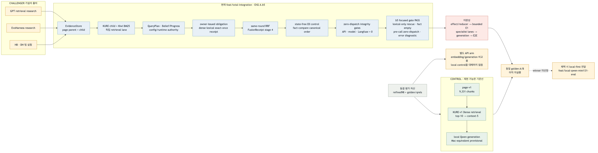
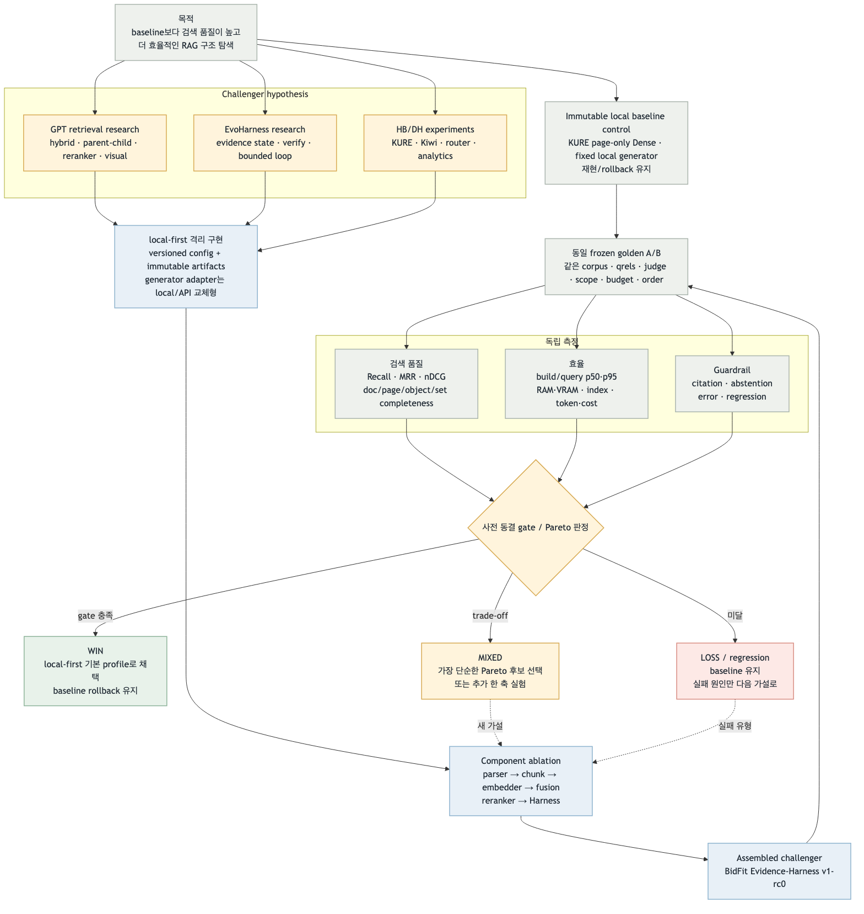

# Local RAG Baseline → Evidence-Harness Challenger 평가 진행 보고서

기준: 2026-09-05 · 현재 작업대 `feat/total-integration` · EH2.6.b5 완료 시점
최종 통합 대상: `feat/local-qwen-mini131-eval`

> **고정된 목적:** 기존 local KURE page-v1 RAG baseline은 최종 구조가 아니라 비교를 위한 control이다. GPT retrieval 연구,
> EvoHarness 연구와 통합안은 더 높은 검색 품질과 효율을 낼 것이라는 challenger 가설이다. 후보를 구현한 뒤
> 같은 frozen golden set으로 품질·효율·안전성을 비교하고, 실측으로 더 나은 아키텍처를 선택하는 것이
> 현재 작업의 목적이다. 측정 전에는 어떤 후보도 우승 또는 최종 구조로 부르지 않는다.

권위 계약: [D-024](../../requirements/decisions.md),
[Current Requirements §1.1](../../requirements/current.md),
[통합 아키텍처 실험 계약](assembly-on-research-and-exp.md),
[Evidence-Harness 구현 계약 §0](bidfit-evidence-harness-v1-rc0.md)

## 결론 먼저 — 지금 무엇을 쓰고 무엇을 만드는가

| 역할 | 현재 대상 | 상태 | 의미 |
| --- | --- | --- | --- |
| 주 비교 통제군 B0 | KURE page-v1 + local Qwen 계열 | Mac-equivalent 측정 완료·provisional | local-first retrieval 비교의 authoritative control. 계속 보존한다. |
| 별도 API arm | `text-embedding-3-small` + `gpt-5-nano` + Streamlit | 사용자-facing 호환 경로 | API-first는 과거 구현 순서이며 local control을 대체하지 않는다. |
| 현재 개발 대상 | `feat/total-integration`의 Evidence-Harness challenger | EH2.6.b5까지 구현 | 독립 lane·RRF fusion·state-free E0와 focused retrieval gate까지 완료. E1/생성 E2E는 미완성이다. |
| 최종 전달 대상 | `feat/local-qwen-mini131-eval` | 병합·선택 전 | 같은 Evidence Pack 뒤에서 local/API generator를 갈아 끼운다. |
| 최종 선택 | baseline 대 assembled challenger | **미실행·미선정** | 동일 골든셋 A/B와 gate/Pareto 판정 뒤 결정한다. |

따라서 **현재 비교할 때 쓰는 것은 local baseline**, **현재 만드는 것은 challenger**, **나중에 기본으로 쓸 것은
아직 미정**이다. EH2.6.b5 작업은 API를 실행한 것이 아니라 API·모델·Langfuse 호출 0회의 provider-free
조립·검증 단계다.

## 이전 → 현재 → 목표

| 구분 | 이전 | 현재 | 목표 |
| --- | --- | --- | --- |
| baseline의 의미 | 먼저 만든 동작 경로 | 재현 가능한 immutable control로 명시 | 모든 후보의 공정한 비교·rollback 기준 |
| 연구 문서의 의미 | 좋은 구성의 참고안 | GPT/EvoHarness/통합안을 challenger 가설로 명시 | 실측에서 이긴 구성만 채택 |
| 구현 | page-only baseline + 분리된 실험 섬 | EvidenceStore, KURE child, Kiwi, RRF, QueryPlan, runtime authority | bounded controller·전문 lane·교체형 generation E2E |
| 평가 | 각 실험의 부분 지표가 혼재 | 구현 PASS와 품질 우승을 분리 | 같은 frozen golden에서 component ablation + assembled A/B |
| 전달 | API UI와 local 실험 경로가 혼재 | 통합 작업대와 최종 local branch의 역할 분리 | local-first 기본 profile, API는 교체형 보조 arm |
| 선택 | 추천 스택을 바로 목표처럼 읽을 여지 | winner 미선정으로 고정 | 품질·효율·guardrail gate 및 Pareto 판정 |

## 같은 계층으로 정렬한 스펙 비교

| 계층 | Baseline control | Research/EvoHarness challenger | 평가 질문 |
| --- | --- | --- | --- |
| 데이터 | refined98 immutable | 동일 snapshot만 사용 | corpus/hash가 완전히 같은가? |
| 파서·근거 | rhwp/pypdf page source | provenance parent + source block/page/bbox | 정확도 향상과 처리비용 변화는? |
| 청킹 | page-v1 9,331개 | heading/paragraph child, table row-group, figure object | Recall과 context 효율이 좋아지는가? |
| 임베딩 | local KURE page control | KURE child 우선, OpenAI small/Qwen3은 별도 동일 조건 후보 | 같은 qrels에서 어떤 embedder가 Pareto 우위인가? |
| lexical | 없음 | Kiwi BM25 독립 child lane | dense miss를 얼마나 rescue하며 비용은 얼마인가? |
| fusion | Dense exact ranking | weighted control vs RRF k=60 | nDCG/MRR·중복·지연이 어떻게 변하는가? |
| reranker | identity/no rerank | optional Qwen3 reranker | pre/post retention과 p95 비용이 타당한가? |
| 질의 제어 | 단일 retrieval pass | QueryPlan, Belief/Progress, bounded verify loop | 복합·비교·후속 질문 completeness가 좋아지는가? |
| 전문 lane | catalog/analytics/visual이 분리 | list·analytics·table·figure bridge | top-N·전수·표·그림 실패가 줄어드는가? |
| 생성 | 비교 중 고정한 local Qwen | 같은 verified Evidence Pack + 교체형 adapter | retrieval 변화와 API/local generator 변화를 분리했는가? |
| 응답·UI | Streamlit 호환 UI | structured claim→evidence→locator | citation validity와 사용자 효용이 유지되는가? |
| 관측 | 오프라인 지표, Langfuse OFF | 실제 E2E에서만 Langfuse opt-in | trace·latency·token/cost가 재현 가능한가? |
| 실행 환경 | Mac provisional / API control | local-first, 최종 GCP L4 검증 | 환경 차이를 모델·검색 품질과 혼동하지 않는가? |

## 현재 구현 흐름

원본: [current Mermaid](evidence-harness-progress-current-flow.mmd)

## 목표 실험·선택 흐름

원본: [target Mermaid](evidence-harness-progress-target-flow.mmd)

## 골든셋에서 무엇을 비교하는가

### 단일변수 실험군

| Arm | 기준선에서 바꾸는 것 | 검증할 가설 | 현재 상태 |
| --- | --- | --- | --- |
| B0 | 없음: page-v1 + KURE Dense top-10 → context-5 + fixed local generator | 비교 출발점 | Mac-equivalent 측정 완료·provisional |
| R1 | child evidence + KURE Dense | 작은 검색 단위가 근거 recall/context 효율을 개선 | 구성요소 구현, paired run 전 |
| R2 | R1 + Kiwi BM25 + RRF k=60 | lexical rescue와 다중문서 coverage 개선 | 구성요소 구현, paired run 전 |
| R3 | R2 + optional Qwen3 reranker | 상위 evidence 순위/retention 개선 | adapter·실측 전 |
| H1 | 선택된 R arm + QueryPlan/slot/coverage/bounded loop | 비교·목록·후속·기권 완전성 개선 | controller 미완성 |
| V1 | 선택된 text arm + table/figure bridge | 표·그림 object recall 개선 | 별도 gate, E2E 전 |

embedder(KURE/OpenAI small/Qwen3) 비교와 API/local generator 비교도 각각 별도 arm으로 수행한다. child,
fusion, reranker, generator를 한 번에 모두 바꾼 결과만으로 원인을 추정하지 않는다.

### B0 측정 출발점

현재 공개 가능한 control receipt는 Mac Ollama/NumPy exact의 `mac_local_equivalent`이며
`official=false`, `passed=false`, named human gold 승인 전 provisional이다.

| 지표 | B0 값 | Challenger |
| --- | ---: | --- |
| Document Recall@1 / @5 / @10 | 0.921986 / 0.987589 / 0.991135 | 미측정 |
| MRR@10 | 1.000000 | 미측정 |
| Set precision / recall / F1 | 0.608974 / 0.692308 / 0.630769 | 미측정 |
| Set exact / count accuracy | 0.538462 / 0.538462 | 미측정 |
| Visual page / object Recall@10 | 0.600000 / 0.000000 | 미측정 |
| Semantic accepted / mean | 88/129 (0.682171) / 70.135659 | 미측정 |
| Runtime error | 6/129 (0.046512) | 미측정 |
| Total latency p50 / p95 | 33,405.49 ms / 263,840.61 ms | 미측정 |

근거: [Mac-equivalent deterministic receipt](../../../evaluation/baselines/gcp-local-kure-qwen3-8b-awq-mini131-v1/mac-local-equivalent-receipt.json),
[semantic receipt](../../../evaluation/baselines/gcp-local-kure-qwen3-8b-awq-mini131-v1/mac-local-equivalent-semantic-receipt.json).
이 값은 challenger가 넘어야 할 출발점이지 현재 구조가 충분하다는 판정도, 공식 GCP 성능도 아니다.

| 축 | 핵심 지표 | 선택에 쓰는 이유 |
| --- | --- | --- |
| 검색 품질 | Recall@1/3/5/10, MRR, nDCG, all-required-doc recall | 정답 근거를 찾는지와 상위 순위를 분리 확인 |
| 위치·객체 | required page/object recall, table/figure locator validity | 문서만 맞고 실제 표·그림을 못 찾는 허상을 방지 |
| 집합 완전성 | set precision/recall/F1, exact count, completeness receipt | top-N·전수 목록 질문의 누락을 검출 |
| 효율 | build/query p50·p95, RAM/VRAM, index size, token·비용 | 품질이 같을 때 더 작은 구성을 선택 |
| 안전성 | citation validity, abstention, error, baseline regression | 품질 향상과 환각·오류 증가의 교환을 차단 |

metric threshold와 non-inferiority 범위는 실제 run 전에 config/freeze receipt로 고정한다. 기존 local
Mini131 결과와 unit/full regression은 출발점·안전성 증거지만 새 assembled challenger의 승리를 증명하지 않는다.

## 현재 완료와 남은 gap

| 상태 | 항목 | 현재 판정 | 다음 gate |
| --- | --- | --- | --- |
| DONE | baseline 보존 | page-only/API·local control 계보 보존 | 매 비교에서 재현 확인 |
| DONE | challenger 검색 골격 | EvidenceStore, child KURE, Kiwi, RRF, QueryPlan/상태 타입 | 회귀 유지 |
| DONE | 실행 권한 경계 | immutable config + exact runtime authority + zero-dispatch | 회귀 유지 |
| DONE | E0 검색 실행·focused gate | owner obligation → dense → lexical → RRF fusion exact-once; rescue/empty/pre-call/error 경계 | EH2.6.c1 candidate projection |
| NOT DONE | 상태 전이·종료 | effect/reducer/bounded controller가 없음 | EH2.6.c~e, EH2.G |
| NOT DONE | 전문 lane E2E | analytics/list/table/figure가 controller 밖 | EH3.1~EH3.G |
| NOT DONE | 생성·평가 조립 | reranker/generator/CLI/layer evaluator 미완성 | EH4.1~EH4.G |
| NOT DONE | 공정 비교 동결 | 공통 freeze receipt와 threshold 미동결 | EXP-SELECT.2 |
| NOT DONE | component/assembled A/B | 실제 동일 golden 비교 미실행 | EXP-SELECT.3~4 |
| NOT DONE | 최종 선택·local 병합 | winner 미선정 | EXP-SELECT.5 + 사람 리뷰 |

## 다음 실행 순서

1. EH2.6.c1 candidate projection부터 effect/reducer→bounded E1 controller를 순차 완성한다.
2. EH3에서 catalog/analytics/list/table/figure specialist를 같은 evidence contract에 연결한다.
3. EH4에서 identity/reranker, local/API generator adapter, CLI와 계층별 evaluator를 완성한다.
4. baseline·local control·challenger의 corpus/gold/qrels/judge/budget/hash와 metric threshold를 동결한다.
5. parser→chunker→embedder→fusion→reranker→Harness component ablation을 수행한다.
6. 가장 좋은 구성의 assembled challenger를 baseline과 full golden E2E로 비교한다.
7. gate/Pareto 판정과 사람 리뷰 뒤에만 local branch 기본 profile을 전환한다. baseline은 rollback용으로 남긴다.

## 검증 상태

- EH2.6.b5 focused 4/4, b3+b4+b5 68/68, 관련 회귀 218/218, 전체 1,179/1,179 PASS.
- b5 focused gate 과정의 API/OpenAI/model-provider/Langfuse 호출은 0이다.
- 이 수치는 구현 무결성 결과이며 retrieval 성능 향상 수치가 아니다.
- 갱신된 Mermaid PNG 2개 생성·직접 시각 검사 PASS.
- HTML parse·로컬 참조·headless Chrome 1440×1100 렌더 PASS.
- repository safety 829 files PASS.

판정: **실험 방향은 고정됐고 challenger 골격은 부분 구현됐지만, 동일 골든셋 성능 비교와 최종 아키텍처
선택은 아직 시작 전이다.**
