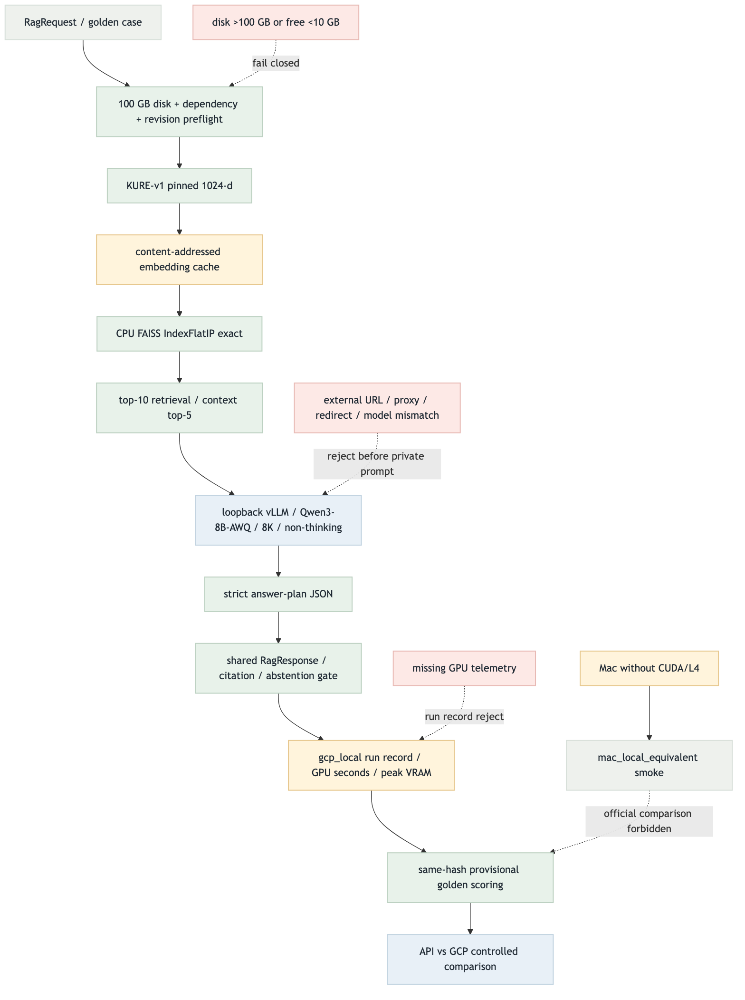
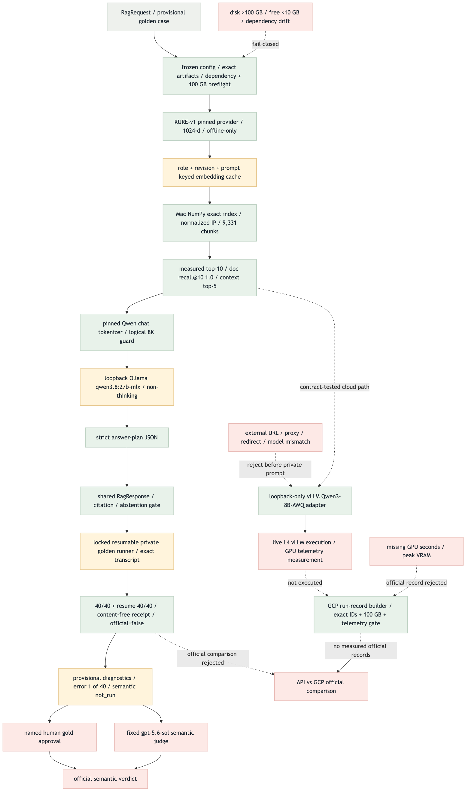

# GCP Local Baseline Flow Validation

검증일: 2026-08-31
범위: refined98 page-only, KURE, exact dense retrieval, Qwen3-8B-AWQ/vLLM contract, Mac-equivalent provisional evaluation

## Target Flow

Target source: [`gcp-local-baseline-target-flow.mmd`](gcp-local-baseline-target-flow.mmd). 아키텍처는
고정했고, 외부 URL 차단 간선의 표현만 실제 계약과 같게 `reject before private prompt`로
바로잡은 뒤 target PNG를 재렌더했다.

## Current Implementation Flow

Current source: [`gcp-local-baseline-current-flow.mmd`](gcp-local-baseline-current-flow.mmd).

## Target vs Current Gap

| ID | Node/edge | Status | Implementation evidence | Remaining gate |
| --- | --- | --- | --- | --- |
| G1 | refined98 → pinned KURE provider/cache/exact index | **MATCHED — measured** | 9,331×1,024 normalized vectors; exact index and all persisted hashes verified; document recall@10 `1.0` | reproduce with FAISS CPU on L4 host |
| G2 | retrieval → loopback vLLM Qwen3-8B-AWQ | **MATCHED — adapter contract** | literal loopback-only URL, proxy/redirect rejection, exact served-model check, strict JSON/non-thinking contract | live L4 inference remains blocked |
| G3 | pipeline → GCP run record / 100 GB gate | **MATCHED — implemented contract** | exact model/revision/runtime/machine constraints, 100 GB validator/schema parity, required GPU fields | populate with live `gpu_seconds` and `peak_vram_gb` |
| G4 | Qwen generation → logical 8K guard | **MATCHED — implemented** | pinned Qwen tokenizer/chat template counts the exact transmitted messages before Ollama generation | preserve the same tokenizer/revision on GCP |
| G5 | private golden cases → resumable runner | **MATCHED — measured** | 40/40 persisted; first completion `executed=38`, `resumed=2`; replay `executed=0`, `resumed=40`; one strict local-model contract error retained | approve draft gold before semantic labeling |
| G6 | Mac run → public receipt | **MATCHED — measured** | content-free receipt; suite complete; recall@1 `0.833333`, recall@10 `1.0`, citation/response contract `1.0`, error rate `0.025` | official remains false by construction |
| G7 | live L4 vLLM → official GPU telemetry | **BLOCKED** | adapter and run-record gates exist, but no L4 execution record exists | explicit VM authorization, live smoke/full run, measured telemetry |
| G8 | official GCP result → API↔GCP comparison | **BLOCKED** | comparison rejects Mac-equivalent evidence correctly | valid same-hash `gcp_local` records with complete telemetry |
| G9 | provisional score → semantic verdict | **PARTIAL / BLOCKED** | retrieval, citation, response-contract, abstention and latency diagnostics are implemented | named human gold approval and fixed `gpt-5.6-sol` semantic judgment |

## Done / Not Done Priority

Scoring: upstream 0–4 + connection 0–3 + safety 0–2 + validation 0–2 + risk -3–0.

| Rank | Work unit | Score | State | Next action |
| ---: | --- | ---: | --- | --- |
| 1 | Local KURE preparation, exact index and 40-case provisional run | 9 | **DONE — measured** | keep the immutable receipt and treat the one generation-contract error as a baseline defect |
| 2 | Live Qwen3-8B-AWQ/vLLM on L4 with telemetry | 7 | **BLOCKED — external execution** | start the VM only with explicit authorization; smoke two cases before the bounded/full run |
| 3 | API↔GCP controlled comparison | 7 | **BLOCKED — depends on rank 2** | compare only valid same-hash official GCP records |
| 4 | Human approval + fixed Sol semantic score | 6 | **PARTIAL / BLOCKED — external review** | approve the draft gold and run the fixed judge over question, answer, gold and retrieved evidence |

The local executable unit is complete. The next highest-value unit is live L4/vLLM verification, but it
is intentionally stopped because starting the VM changes paid external state and requires explicit user
authorization. Human approval and the fixed semantic judge are a separate evidence gate.

## Scoring Criteria

- Upstream and connection value reward paths that unlock retrieval, generation and comparable evaluation.
- Security value rewards loopback-only transport, private artifact boundaries, content-free receipts and
  false-label prevention.
- Validation value rewards deterministic contract/schema tests that run without model weights.
- Risk penalizes paid/live VM execution, large downloads and human-only review gates.

## Color Semantics

- Green: implemented and validated normal control path.
- Blue: selected external/cloud projected model path.
- Amber: private, local-first or explicitly non-official evidence path.
- Red: blocked, restricted, unsupported or fail-closed path.
- Gray: branch, helper or exact-control input.

## Validation Evidence

- Implementation sources: `stacks/local/hf_embeddings.py`, `stacks/local/qwen_tokenizer.py`,
  `stacks/local/vllm_generation.py`, `stacks/local/run_records.py`, `gcp_local_baseline.py`, the frozen
  baseline config and `run-record.schema.json`.
- The frozen configuration verifies 98 manifest rows, 9,331 page chunks, 40 draft golden cases and the
  exact corpus/evaluation/dependency hashes before model work.
- The Mac-equivalent run completed 40/40, emitted a content-free aggregate receipt, and passed a no-new-call
  resume replay (`executed=0`, `resumed=40`). Preflight measured a 9,169,366,585-byte working set and passed
  the 100 GB/free-space guard.
- Mermaid target/current source is rendered with `mmdc 11.15.0`, transparent background and scale 2.
- Static parse QA found two images, four valid local links, no missing target, the five-color legend,
  nine gap rows, four priority rows, seven validation items and the closeout verdict.
- Headless Chromium `file://` QA loaded both images at non-zero natural dimensions: target
  `1568×2104`, current `1568×2660`; the rendered page shows both charts and the closeout tables.
- Closeout verdict: **IMPLEMENTATION MATCHED / LIVE GCP AND SEMANTIC EVIDENCE BLOCKED**.
