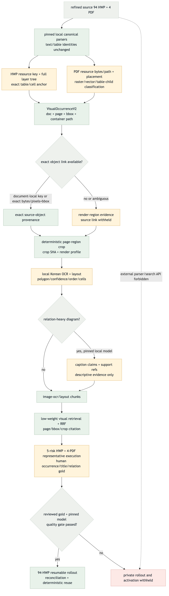
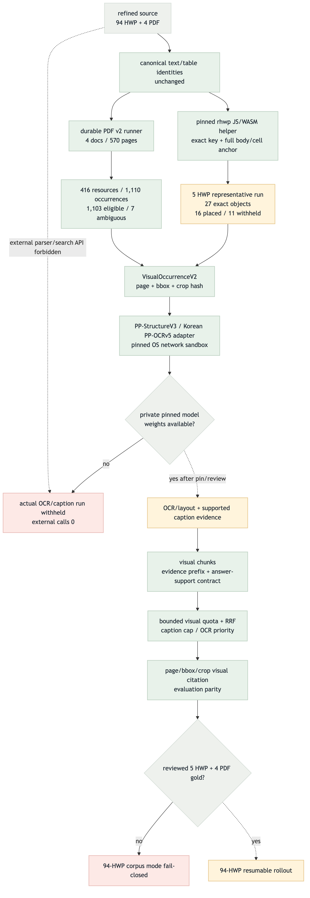

# HWP/PDF visual parsing flow validation

최종 갱신: 2026-08-30
상태: **CLOSEOUT / PUBLIC_IMPLEMENTATION_COMPLETE / PRIVATE_GATES_BLOCKED / LOCAL_ONLY**

## 2026-08-30 시작 리포트

이번 cycle의 target은 기존 표 visual-context 완료 상태에서 그림·도식 evidence를 복구하는
`source/object → occurrence → deterministic crop → OCR/layout → optional supported caption →
visual retrieval/citation` 흐름이다. 기존 HWP/PDF 본문·표 identity는 그대로 유지하고 additive v2
record만 만든다.

현재 HWP v1은 문서 전체 ordinal/count/aspect gate 하나가 실패하면 그 문서의 source/render link를
전부 보류한다. PDF PoC artifact는 현 복구 코드보다 오래됐고 resource bytes/xref와 durable runner가
없다. 두 경로 모두 OCR 또는 caption을 붙일 안정적인 occurrence crop 계약이 아직 없다.

### Target vs Current Gap

| ID | Target node/edge | Current | Status | Catch-up proof |
| --- | --- | --- | --- | --- |
| V1 | additive `VisualOccurrenceV2` identity | v1별 record만 존재 | GAP | strict schema + mixed-state reconciliation |
| V2 | HWP exact resource key and nested-cell anchor | global ordinal, cell path loss | GAP | key 1:N, nested path, no duplicate tests |
| V3 | exact fallback and deterministic crop | count/aspect all-or-nothing | GAP | raw/RGBA+bbox unique match + crop hash |
| V4 | PDF resource/placement recovery | stale geometry candidate | GAP | durable runner, resource/path/bbox reconciliation |
| V5 | local OCR/layout evidence | absent | GAP | pinned offline adapter + schema/cache tests |
| V6 | supported caption claims and visual citation | absent | GAP | support-ref guard + low-weight retrieval tests |
| V7 | representative then full rollout | old v1 rollout only | PARTIAL | public synthetic gate + private opt-in runner |

### Done / Not Done Priority

점수는 `upstream_weight(0–4) + connection_value(0–3) + safety_value(0–2) +
validation_value(0–2) + risk_penalty(0~-3)`이다.

| Rank | Unit | U | C | S | V | R | Score | Start action |
| ---: | --- | ---: | ---: | ---: | ---: | ---: | ---: | --- |
| 1 | occurrence identity/schema/promotion | 4 | 3 | 2 | 2 | 0 | 11 | selected foundation |
| 2 | HWP exact key + mixed state + cell anchor | 4 | 3 | 2 | 2 | -1 | 10 | after schema |
| 3 | deterministic exact fallback/crop | 3 | 3 | 2 | 2 | -1 | 9 | parallel after identity |
| 4 | PDF durable recovery/runner | 3 | 3 | 2 | 2 | -1 | 9 | parallel after identity |
| 5 | local OCR/layout adapter | 2 | 2 | 2 | 2 | -1 | 7 | after crop producers |
| 6 | caption/retrieval/citation | 1 | 2 | 1 | 2 | -1 | 5 | after OCR/layout |
| 7 | private 5→94 execution | 1 | 2 | 1 | 1 | -3 | 2 | opt-in when private inputs/models exist |

릴레이는 score 11의 occurrence identity/schema를 첫 단위로 선택했다. 계약의 7개 배치는 dependency
ledger로 끝까지 실행하며, private source나 model weight가 필요한 실행만 public code completion과
분리해 terminal blocker로 기록한다.

### Color Semantics

- green: local server-owned validated path
- blue: external/cloud projected path
- amber: local-first, review, derived, or withheld path
- red: blocked, unsupported, or implementation gap
- gray: source, branch, or exact-control helper

### Start validation

- target/current Mermaid source refreshed for the v2 recovery cycle
- prior HWP 94/94 and PDF 4-document aggregate evidence retained below
- PNG/HTML/browser render evidence is regenerated at start and again at closeout

## 목표 흐름

## 현재 흐름

## 완료 판정

기존 canonical HWP page/table과 source block ID를 바꾸지 않고, 서로 다른 위험 유형 5건을 먼저
통과시킨 뒤 refined HWP 94건 전체의 RenderTree 순서·표 시각 증거·DocLang source asset을 별도
private visual bundle로 생성했다. 94건을 즉시 재실행해 전부 strict reuse로 판정했고 aggregate
artifact-set digest가 동일했다.

전체 visual overlay를 기존 35,128개 table chunk에 결합한 `table-md-visual-context-v2`와
provider-free local index도 두 번 결정적으로 생성했다. 외부 parser, embedding, 검색 API는 호출하지
않았으며 기본 Streamlit runtime은 아직 전환하지 않았다.

PDF는 4건 570쪽 local PoC를 완료했지만 선 기반 detector가 조직도 box를 표로 과검출하고 일정표
row text를 cell matrix에 정렬하지 못하는 사례가 있어 verified table lane으로 승격하지 않는다.

## 차이 분석

| ID | 목표와 현재 차이 | 최종 검증 결과 | 종료 상태 |
| --- | --- | --- | --- |
| G1 | page 안 text/table/image 순서 | 94건, 8,762쪽, ordered occurrence 77,607개 | local complete |
| G2 | cell Rect/fill evidence | 표 10,787개 exact reconciliation; verified render 10,687개, unresolved 100개 명시 | local complete |
| G3 | image asset/hash/MIME/page/bbox | supported source reference 440개, per-document unique 합계 410개·global object 406개; verified page link 58개, asset-only 382개 | strict partial |
| G4 | source asset 형식·provenance | WMF/GIF 12개는 원본 hash/size/MIME를 보존하고 served object/link 없이 unsupported로 기록 | explicit limitation |
| G5 | PDF 표·그림 fidelity | 1,270 geometry candidate 결정적 생성 | PoC complete, verified adoption withheld |
| G6 | OCR/diagram understanding | 구현하지 않음 | separate contract |
| G7 | v2 corpus/index/runtime | v2 35,128 chunks와 local index·RRF·citation smoke 완료 | external/default activation blocked |

## 검증 증거

- Gate A: 구조 위험이 다른 5건을 5/5 생성하고, 즉시 재실행에서 5/5 reuse와 동일 digest를 확인했다.
- Gate B: refined HWP 94/94 성공, 실패 0, page 8,762개·table 10,787개 exact reconciliation,
  즉시 재실행 94/94 reuse를 확인했고 private corpus identity 값은 Git 밖에 유지했다.
- 표 상태: `verified_render` 10,687, `layout_unresolved` 59,
  `render_occurrence_unresolved` 41이다. 불확실 항목을 추정해 verified로 승격하지 않았다.
- 그림 상태: `verified_asset_render` 58, `asset_only_unlinked` 382,
  `unsupported_source_asset` 12, `render_only_missing_asset` 498이다. source asset이 있는 문서의
  count/aspect/key가 완전 일치하지 않으면 문서 내 일부 항목만 임의 연결하지 않는다.
- Gate C: 기존 35,128개 table chunk의 Markdown·locator·page range·source/table identity를
  보존했다. prior-context 19,828개, strict schedule-context 70개를 추가했고 두 실행의 private
  chunk identity가 동일함을 Git 밖에서 확인했다.
- Local retrieval: 35,128개를 `local-hash-char-v1` 2,048차원 index로 생성했다. 두 번째 실행은
  cache hit 35,128/35,128이며 외부 전송·비용은 0이다. 독립 smoke의 세 query variant에서 known
  schedule fact가 table lane rank 1이었고, page/table RRF의 일치 근거는 fused rank 1~3, 인용된
  table은 rank 2였다. citation의 doc/chunk/page/locator identity도 일치했다.
- PDF: 4건 570쪽, candidate 1,270개(table-line 843, image-geometry 427), 두 실행
  byte-identical이다. 이 수치는 semantic object 수가 아니다.
- 독립 전수 감사: Schema instance 124,568개 오류 0, 94/94 strict bundle, 35,128개 local vector
  전수 재계산 불일치 0이다. 전체 unittest 388/388, compileall, `git diff --check`, repository safety
  516 files를 통과했다.
- 보고서 QA: 실제 Chrome 1,440/1,024/390px에서 horizontal overflow 0, image load 정상,
  page error 0이다.

## 품질 경계

이번 완료는 “HWP 표와 source image bytes를 누락 없이 보존하고, 증명 가능한 연결만 검색 문맥에
사용한다”는 local artifact gate다. 그림 58개만 page render와 strict하게 연결됐고 382개는
asset-only, 12개는 unsupported source evidence이므로 그림 내부 내용 검색이나 모든 그림의 페이지
배치를 지원한다고 주장하지 않는다. OCR/VLM/diagram summary도 없다.

사람 fidelity review와 destination-specific private corpus egress·비용 승인이 끝나기 전에는
OpenAI embedding, Upstage, 다른 외부 parser, 기본 runtime 전환을 수행하지 않는다.

## 다음 릴레이

| 순위 | 단위 | 조건 |
| ---: | --- | --- |
| 1 | 5건 private 사람 fidelity gold | 표 제목·행/열·fill과 그림 위치를 원본 HWP/PDF와 대조 |
| 2 | v2 semantic embedding/index/RRF/citation 활성화 | 목적지별 egress·비용 명시 승인 |
| 3 | PDF row alignment calibration + OCR/diagram lane | false-positive gold와 local model pin |
| 4 | Upstage 선택 표본 비교 | 외부 원문 전송을 별도 승인할 때만 |

현 Streamlit 기본 runtime은 이 산출물을 아직 사용하지 않는다. local rollout은 닫았고 다음 안전한
단위는 사람 fidelity review다.

## 2026-08-30 해결 계약 addendum

후속 감사에서 OCR·caption만으로는 HWP asset-only 항목의 page/title/order나 PDF geometry
candidate의 실제 객체 의미를 복구할 수 없다고 판정했다. 다만 HWP render-only occurrence와
PDF page region은 page+bbox가 있으므로 deterministic crop을 만들면 source asset exact link 없이도
페이지 검색 근거가 될 수 있다.

또한 저장된 PDF PoC artifact가 현 복구 코드보다 먼저 생성됐고 대표 일정표 2개의 first-column
body label이 전부 비어 있음을 확인했다. 843/427 수치는 계속 candidate 재고지만 current-code fidelity
근거는 아니다. durable runner를 만든 뒤 4건을 v2로 재생성하기 전에는 OCR 입력으로 승격하지 않는다.

후속 구현 순서는 다음으로 고정한다.

1. HWP 5유형 + PDF 4건 human occurrence gold
2. PDF durable runner와 current-code 4건 v2 재생성
3. rhwp `sourceImageKey` helper, occurrence별 혼합 상태와 table-cell anchor
4. HWP/PDF page-render crop, raw/RGBA+bbox exact fallback, raster/vector/table-child 분리
5. PP-StructureV3/Korean PP-OCRv5 OCR·layout
6. 필요한 도식만 local VLM caption, 별도 저가중치 retrieval와 crop citation
7. 대표 gate 통과 후 HWP 94건 전수 실행

상세 상태·schema·승격 규칙·acceptance는
`visual-image-recovery-and-understanding.md`가 이 addendum 이후의 권위 계약이다. 외부 API와 기본
runtime 활성화는 계속 금지한다.

## 2026-08-30 해결 구현 closeout

이 절은 위 시작 리포트와 기존 v1 완료 판정 이후의 최종 current state다. 공개 구현과 실제
대표/4-PDF 실행은 완료했고, 사람 review와 model weight가 필요한 private activation은 추정하지 않고
차단 상태로 닫았다.

| ID | Target | Final evidence | Status |
| --- | --- | --- | --- |
| V1 | additive occurrence identity | 폐쇄형 v2 schema, stable ID, mixed occurrence validator | MATCHED |
| V2 | HWP exact key/cell anchor | pinned helper·runner, 대표 5건 exact object 27 | MATCHED |
| V3 | deterministic crop/fallback | page+bbox 16건 crop 승격, page 없는 11건 withheld | MATCHED |
| V4 | PDF durable recovery | 4건 570쪽, resource 416, occurrence 1,110 | MATCHED |
| V5 | local OCR/layout | pinned adapter·cache·OS network sandbox 구현, 실제 weight 부재 | CODE_MATCHED / RUN_BLOCKED |
| V6 | caption/retrieval/citation | support-ref guard, bounded visual quota, visual gold scoring parity | MATCHED_PUBLIC |
| V7 | 5→94 rollout | 대표 5건 실행·reuse 완료, reviewed 9건 gold 없이 94 모드 거부 | PARTIAL / BLOCKED |

### 실제 실행 증거

- HWP 대표: 5문서, occurrence 27건, exact source object 27건이다. page+bbox가 검증된 16건만
  retrieval eligible이며, page를 증명할 수 없는 11건은 `doc_only_unlinked/withheld`다.
- HWP 재실행: 같은 artifact-set ID와 세 artifact hash를 strict reuse로 재검증했다.
- HWP 전수 gate: `mode=corpus`를 gold 없이 실행하면 helper 시작 전에
  `hwp_visual_runner_gold_gate_required`로 중단된다. 94건을 실행했다고 주장하지 않는다.
- PDF: 4문서 570쪽, resource 416개, occurrence 1,110개다. 1,103개는 crop 근거로 eligible,
  drawing complexity 상한을 넘은 7개는 `ambiguous/withheld`다.
- PDF 재실행: artifact-set ID와 object/occurrence/resource artifact hash 세 개가 모두 동일했다.
- OCR/caption: 공개 fixture와 runner는 완성됐지만 pinned private weight가 없어 실제 crop inference는
  0건이다. macOS 고정 sandbox profile의 loopback socket probe는 `EPERM`을 반환했다.

### 통합 수리와 검증

- full base top-k에서도 bounded visual slot을 남기고, caption cap 적용 전 전체 visual 후보를
  조회해 뒤의 OCR/layout을 잃지 않는다. caption은 base와 OCR/layout 아래에 둔다.
- `caption → cap_*`, `ocr/layout → ocr_*`를 chunk·response·run-record와 수동 validator 모두에서
  강제한다. support reference 없는 caption-only 답변은 자동 기권한다.
- visual gold는 document+occurrence+evidence type+evidence ID 집합을 exact 비교한다. visual gold가
  없는 기존 평가에서는 visual citation을 잘못된 0점으로 넣지 않는다.
- 전체 unittest 493/493, compileall, Draft 2020-12 schema 23개, diff-check와 repository safety
  556 files를 통과했다. private source text·filename·crop은 Git 대상에서 제외했다.

### 남은 명시적 blocker

1. 사람이 검토한 HWP 5건 + PDF 4건 occurrence/title/OCR/관계 gold
2. checksum이 고정된 PP-StructureV3/Korean PP-OCRv5 weight와 실제 품질 측정
3. 위 두 gate 통과 후 HWP 94건 전수 및 visual retrieval gold
4. 별도 승인 전 기본 Streamlit/runtime 또는 외부 parser/search API 활성화 금지
