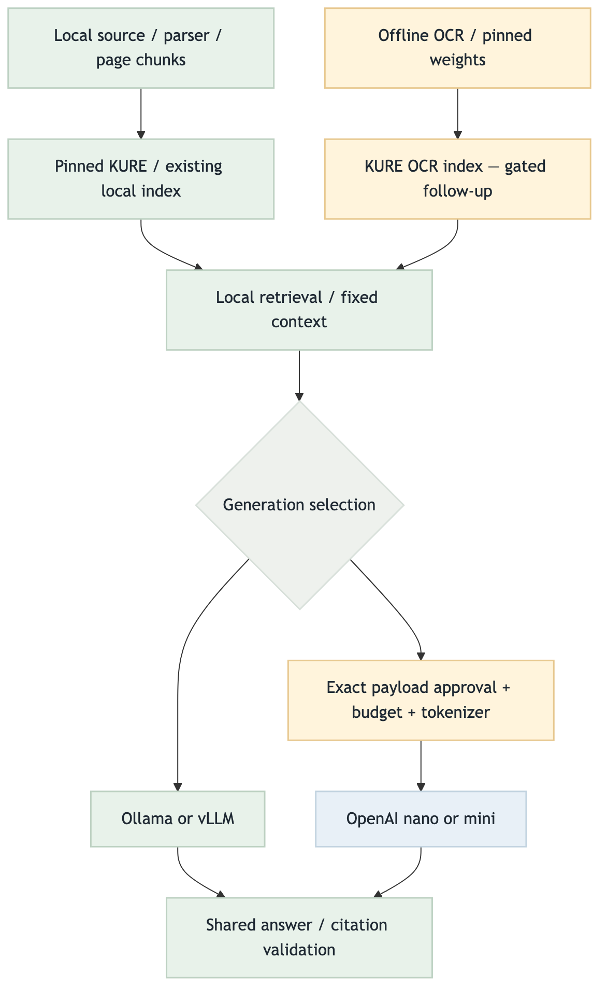
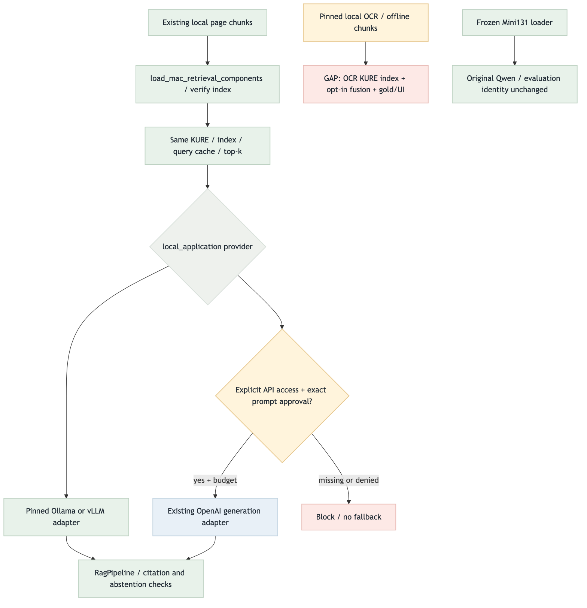

# Local-first integration validation

Date: 2026-09-03. Verdict: **PASS_WITH_RISKS** for local code integration and interchangeable generation.
Not a VLM completion, OCR retrieval activation, live API run, or deployment claim.

## Contract / environment

- Contract: [local-visual-integration.md](local-visual-integration.md).
- Worktree: `/Users/pio/Documents/AIENGINEERCOURSE/MidProjectRAG-local-visual`.
- Source checkout: `/Users/pio/Documents/AIENGINEERCOURSE/MidProjectRAG`, preserved dirty/on visual branch.
- Python 3.12.13 from source `.venv`; PYTHONPATH points to integration `src`.
- OCR files selectively committed at `5c732eb`; local tip `6e5da22` merged without conflicts.
- No API branch/harness branch merge, private resources copy, embedding rebuild, live generation, main change or push.

## Target / current flows and color semantics

The exact diagrams are [target Mermaid](local-first-generation-target-flow.mmd) and
[current Mermaid](local-first-generation-current-flow.mmd), rendered with mmdc 11.15.0.

Green: validated normal control; blue: external model adapter; amber: sensitive/local approval;
red: blocked or explicit GAP; gray: selection. Diagram validation covers implementation wiring,
not model accuracy. [Interactive-free HTML report](local-first-generation-flow.html).

## Target vs current gaps / priorities

| Target | Current | Status / next action |
| --- | --- | --- |
| Local-only integration | OCR runtime + latest local contracts; no API branch merge | PASS |
| Replace only LLM | local_application composition; existing local retrieval reused | PASS, mocked transports |
| Fixed evaluation baseline | load_mac_pipeline retains Qwen/RecordingGenerator/profile | PASS, regression |
| API safety | official destination + per-prompt approval + budget; no ambient keys/fallback | PASS, negative cases |
| OCR text retrieval | Offline runtime/chunks only | GAP: KURE OCR index, admission/dedup, caption exclusion, opt-in |
| UI/live quality | Existing UI unchanged; private corpus absent here | SKIPPED_WITH_REASON / follow-up |

Next-task score = upstream(0–3) + connection(0–3) + safety(0–2) + validation(0–2) + risk(-3–0).
Not agent scoring and not an automatic relay authorization.

| Priority | Status | Score | Reason |
| --- | --- | --- | --- |
| Local merge / LLM composition | Done | N/A | Current request |
| OCR qrels/admission/caption exclusion | Pending | 9 = 3+3+2+2-1 | Before factual answer use |
| OCR index/opt-in/golden E2E | Pending | 7 = 2+3+2+2-2 | Depends on safety/quality gates |
| Image embeddings/VLM | Deferred | 0 = 0+1+1+1-3 | Demonstrated failures first |

## Test runner ledger

- `PYTHONPATH=src <source>/.venv/bin/python -m unittest tests.answering.test_local_composition ...`
  exercised actual shared pipeline, local hash fixture index and real adapter code with fake Ollama/vLLM/OpenAI transports.
- Model swap: same index/provider/cache objects, same ranked evidence/citations; cached query does not call embed again.
- OpenAI nano/mini preserve strict response/citation checks; exact prompt/instructions approval recorded before send.
- Missing API access, denied prompt, changed endpoint, bad model/provider, remote embedder, unknown scope and no-fallback checks pass.
- `PYTHONPATH=src <source>/.venv/bin/python -m unittest discover -q -s tests -t .`
  final result: **680 tests, 658 passed, 22 skipped, 0 failures/errors**, 12.463 seconds.
- Final private Mini131 test class: six synthetic cases pass; nine private-data cases explicitly skip.
- OCR/safety focused 32/32 pass; combined provider/pipeline/OCR/safety 82/82 pass (overlapping suites, not additive).
- `git diff --check` and repository safety gate required again before commit.

## Browser / visual evidence

- mmdc generated both PNGs. Browser script: `scripts/check_local_generation_report.cjs`.
- Bundled Node/Playwright with explicitly installed Chromium; local `file://` only.
- PASS: two loaded diagram images, four tables, all headings/legend visible, zero page errors;
  mobile width 390px has no horizontal page overflow. Screenshot visually inspected.
- Evidence: `fivecircles/test/playwright-screenshots/local-first-generation-flow-2026-09-03.png`.
- This is report-render validation, not Streamlit UI integration validation; Streamlit was unchanged.

## Failures, fixes and risk boundaries

[Error/fix log](../../test/errorlogs/backend/2026-09-03-local-visual-integration.md): private fixture loading,
provider import boundary and synthetic response shape corrected; all current checks rerun.

Actual private-gold/model/GCP/UI checks are not completed by these tests. `load_mac_retrieval_components`
currently reuses the verified Mac-local index loader; selecting vLLM does not certify a GCP deployment.
API endpoint/client/counter/approval are server-owned injected dependencies. No blanket approval callback
is supplied by the library. OCR-derived API text remains subject to D-020, and image/VLM upload remains off.
Existing page embeddings and frozen metric receipts are not regenerated. CLI/UI selectors and OCR lane activation
remain explicit later work rather than implied by these generation profile files.
