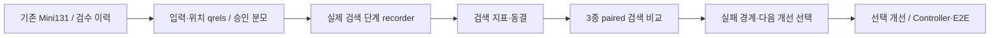
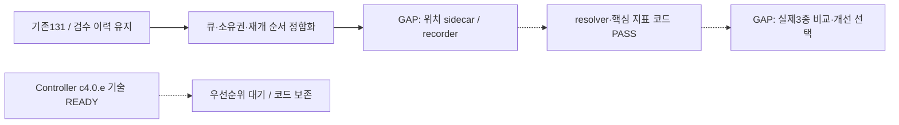

# 검색 비교 우선 재구성 — 원샷딜·릴레이 원장

작성: 2026-09-05 · 사용자 승인: TODO 재구성 후 로그올·다음 TODO 착수.

## 목적과 계약

기준선은 최종 구조가 아니라 비교 대조군이다. 기존 Mini131에서 검색 품질과 효율을 측정해
연구·통합안의 어떤 부분이 유효한지 판단한다. Controller 전체 구현을 첫 검색 비교의 선행 조건으로 두지 않는다.
현재 브랜치 `feat/total-integration`과 local-first 방침, 기본 profile, VLM, 원문·질문·답변은 유지한다.
이 문서는 실행 순서만 조정한다. 기존 의존성/안전 계약을 해제하거나 성능 향상을 선언하지 않는다.

## Cycle A — 실행 큐/소유권/복구 문서 재구성

| 단계 | 실행 내용 | 상태 |
| --- | --- | --- |
| 0 Scope Intake | TODO ID·완료 이력 보존, 상단 실행 큐와 checkpoint/resume 정합화 | COMPLETED |
| 1 Start Report | `2026-09-05-stage-evaluation.md` target/current 및 현재 TODO 대조. mermaid-flow-report 적용 | COMPLETED |
| 2 Relay Unit Selection | 사용자 명시 우선: 재구성. 후속 EVAL 입력 11점, recorder 9점, Controller 4점 | COMPLETED |
| 3 Doc / Contract | doc-contract-writer: 평가셋=EVAL.4 / 채점·기록=EH4.7 / 동결·비교=EXP-SELECT 단일 소유 | COMPLETED |
| 4 Implementation | one-go/batch-sequential-runner: 문서만 순차 패치, 앱/모델 변경 없음 | COMPLETED |
| 5 Validation + Report | ID157 상태 보존·중복0、112 회귀 PASS、독립 APPROVE、PNG2 직접 검토 | PASS_WITH_RISKS: HTML browser BLOCKED |
| 6 Repair Loop | schema 선행/pre_context_stage와 사전 paired 분모 2건 보완·재리뷰 APPROVE | COMPLETED |
| 7 Push / Publication | 이번 소유 변경만 선택 stage. resources·기존 사용자 dirty 제외, force 금지 | PENDING |
| 8 Closeout Report | Mermaid/PNG/HTML·gap·새 점수표, logall 반영 | COMPLETED / HTML browser BLOCKED |
| 9 Relay Shot | 다음 `EH2.EVAL.4.a` 입력·위치 가용성 감사, 아래 새 폼 작성 | SELECTED; push 후 시작 |
| 10 Final Ledger | 문서/검증/푸시/리포트/릴레이의 실제 결과로 갱신 | PENDING |

### 재구성 완료 기준

- 상단 큐는 기존 ID 참조다. Phase 상세 목록은 이력/범위이며 자동 실행 순서가 아니다.
- 구현 leaf는 하나씩, 관련 leaf를 공통 납품 cycle로 묶는다. 각 leaf는 집중 테스트·짧은 checkpoint,
  통합 경계는 영향 기반 회귀·독립 리뷰·보고·로그·선택 push·새 relay form을 수행한다.
- `EH2.6.c4.0.e`는 기술적으로 READY지만 우선순위 대기다. 실제 기술 의존성 BLOCKED와 구분한다.
- Mini131 = core40 + answer56 + set13 + visual10 + analytics10 + parser2. 총 inventory는 유지하고,
  지표별 eligible/missing/not-applicable 분모를 공개한다. 전용 suite는 텍스트 평균에 합치지 않는다.
- 기존 보조69 검수/11건 수정은 재사용한다. 정형 승인 필드 미완료를 전체 사람 검수 부재로 해석하지 않는다.
- qrels가 부족하면 위치 보강/검수 준비까지만 자동화한다. 모델 답변·검색 결과를 gold로 승격하지 않는다.
- 승인 전 smoke/진단과 공식 품질 판정은 구분한다. qrel 승인과 동결 전 tuning·우승 판정·기본 profile 전환 금지.
- recorder 최소 설정 schema(EXP-SELECT.2.a)는 b.1 전에 정의한다. 정식 qrel/threshold freeze는 b.2 후,
  paired run 전에 완료한다. `pre_context_stage`는 dense-only=lane_dense, hybrid=fusion으로 지정한다.
- paired eligible 분모는 승인 qrel/지원범위로 실행 전에 봉인한다. arm 오류/단계 누락을 이유로 사후 축소하지 않는다.

## 선택 점수

relay-shot 가중치: upstream 0–4 + connection 0–3 + safety 0–2 + validation 0–2 + risk 0…−3.
이전 단계 보고서의 0–3 균등 가중치 대신 스킬의 가중치를 사용한다. 점수는 품질 점수가 아니다.

| 후보 | 계산 | 점수 | 연결할 경로 |
| --- | --- | --- | --- |
| EH2.EVAL.4.a 입력 inventory/위치 가용성 | 4+3+2+2+0 | 11 | 기존131 → 평가 가능/누락 근거 구분 |
| EH4.7b.1 실제 단계 recorder | 3+3+2+2−1 | 9 | 검색 → 기록 → 기존 resolver/scorer |
| EXP-SELECT.2.a + EH4.7c.1 | 2+3+2+2−1 | 8 | 공정한 비교 조건/지표 동결 |
| EH2.6.c4.0.e | 1+2+1+1−1 | 4 | Controller 후속; 첫 검색 비교에는 불필요 |

## 검증 제약

HTML 브라우저 QA는 기존 file URL 접근 정책 거절로 BLOCKED이며 다른 브라우저·로컬 서버로 우회하지 않는다.
PNG 생성/직접 이미지 검토와 문서 정적 검증은 별개다. HTML 스크린샷 PASS로 표기하지 않는다.
이번 문서 변경에는 앱 빌드/모델 실행이 필요하지 않다. 이전 코드 변경을 함께 납품할 경우 해당 회귀를 재검증한다.
AlphaFlower 전용 provider-policy-flow-validation.md는 이 프로젝트에 적용하지 않는다.

## Target Flow

## Current Flow

## Target vs Current Gap

| 노드·연결 | 판정 | 증거 / 다음 조치 |
| --- | --- | --- |
| 기존131·검수 이력 보존 | MATCHED | 문항/답변 파일 무수정, suite 분모 계약 유지 |
| 실행 큐·책임·복구 경로 | MATCHED | TODO/checkpoint/resume 재구성; 기존 ID 157개 상태 보존 |
| source join·핵심 채점 코드 | MATCHED | 112 집중·관련 테스트 재실행 PASS; 품질 점수 아님 |
| 기존 입력 → 위치 sidecar → 실측 recorder | GAP | EVAL.4.a/b/c 및 EH4.7b가 다음 경로 |
| 동결 → 세 구성 비교 → 개선 선택 | GAP | EXP-SELECT.2.a / EH4.7c.1 / EXP-SELECT.3.a/b 미실행 |
| Controller → 전문 경로·생성/E2E | PARTIAL | 기존 구현 유지; 검색 선행 예외가 E2E gate를 닫지 않음 |

색: 초록=검증된 경로, 주황=private/local-first·승인, 빨강=미연결, 회색=선택·우선순위 제어.
파랑은 외부 모델 경로이며 이번 흐름에는 없다.
흐름 소스·PNG·HTML은 이 문서와 같은 basename이다. **Flow diagram verification: GAP/PARTIAL**.

## Cycle A 검증 기록

- 기존 ID 체크 상태 157개 보존, 현재168개·중복0. 새11개는 기존 부모의 실행 가능한 하위 leaf다.
- `git diff --check` PASS. safety904파일 PASS. 위 112 테스트 PASS(1.274초).
- 독립 리뷰에서 schema 선행 순서·pre-context 단계 및 고정 paired 분모 2건을 보완했다.
- 앱/model/API/VLM 실행/변경 0. HTML browser QA는 기존 정책 차단을 유지한다.
- 통합 납품 회귀(2026-09-06): 전체1393건 중 최초1390 PASS/환경실패2/skip1.
  실패한2건만 승인된 권한에서 재실행해2 PASS(0.445초). 코드 수리 없음. 단일 전체 실행 PASS로 소급하지 않는다.
  근거: `../test/errorlogs/backend/2026-09-06-search-first-test-permissions.md`.

## Cycle B — Mini131 입력·위치 가용성 및 private adapter

| 단계 | 실행 내용 | 상태 |
| --- | --- | --- |
| 0 Scope Intake | EH2.EVAL.4.a → .4.b, 기존131/검수69 재사용. .4.c 의미 승인은 자동 대체하지 않음 | READY |
| 1 Start Report | 위 target/current의 입력→sidecar GAP, mermaid-flow-report 기준 사용 | COMPLETED |
| 2 Relay Unit Selection | relay-shot: EVAL.4.a 11점, 최상단 미연결 입력 노드. 기존8source/hash 재검증부터 | SELECTED |
| 3 Doc / Contract | doc-contract-writer: stage-evaluation-v1 sidecar와 기존 pinned Mini131 config 재사용; closed 가용성 ledger | READY |
| 4 Implementation | one-go/batch-sequential-runner: .4.a 읽기 감사 후 .4.b adapter/합성 tests를 순차 구현. source/gold 불변 | NOT_STARTED |
| 5 Validation + Report | 131 ID·suite count,8file SHA, owner/locator, 누락/null, user scope/gold 분리, private exclusive write | READY |
| 6 Repair Loop | 입력/adapter 검증 실패만 작은 leaf로 수리; 없는 근거 추정 금지 | NOT_NEEDED_YET |
| 7 Push / Publication | 승인 범위 코드·계약·집계만 선택 push, private sidecar/trace 제외 | NOT_STARTED |
| 8 Closeout Report | 같은 원장/HTML에 실제 입력 집계·코드/실측 상태 갱신, logall | NOT_STARTED |
| 9 Relay Shot | 다음 .4.c의 외부 승인 여부 점검, 준비된 recorder 최소 schema/구현으로 연결 | NOT_STARTED |
| 10 Final Ledger | 현재는 새 폼만 선택; Cycle A push 성공 후 CONTINUE_WITH_NEXT_FORM로 시작 | READY |

브라우저 제약은 Cycle B에서도 유지한다. golden/model 호출 없이 입력 가용성을 먼저 감사한다.
사람 검수 결과와 ID/hash 통과를 별도 필드로 유지하며 새 gold를 만들어낸 것으로 기록하지 않는다.
