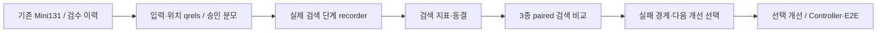
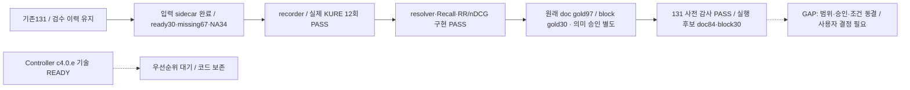

# 검색 비교 우선 재구성 — 원샷딜·릴레이 원장

작성: 2026-09-05 · 사용자 승인: TODO 재구성 후 로그올·다음 TODO 착수.

## 목적과 계약

기준선은 최종 구조가 아니라 비교 대조군이다. 기존 Mini131에서 검색 품질과 효율을 측정해
연구·통합안의 어떤 부분이 유효한지 판단한다. Controller 전체 구현을 첫 검색 비교의 선행 조건으로 두지 않는다.
현재 브랜치 `feat/total-integration`과 local-first 방침, 기본 profile, VLM, 원문·질문·답변은 유지한다.
이 문서는 실행 순서만 조정한다. 기존 의존성/안전 계약을 해제하거나 성능 향상을 선언하지 않는다.

## Cycle A — 실행 큐/소유권/복구 문서 재구성

| 단계 | 실행 내용 | 상태 |
| --- | --- | --- |
| 0 Scope Intake | TODO ID·완료 이력 보존, 상단 실행 큐와 checkpoint/resume 정합화 | COMPLETED |
| 1 Start Report | `2026-09-05-stage-evaluation.md` target/current 및 현재 TODO 대조. mermaid-flow-report 적용 | COMPLETED |
| 2 Relay Unit Selection | 사용자 명시 우선: 재구성. 후속 EVAL 입력 11점, recorder 9점, Controller 4점 | COMPLETED |
| 3 Doc / Contract | doc-contract-writer: 평가셋=EVAL.4 / 채점·기록=EH4.7 / 동결·비교=EXP-SELECT 단일 소유 | COMPLETED |
| 4 Implementation | one-go/batch-sequential-runner: 문서만 순차 패치, 앱/모델 변경 없음 | COMPLETED |
| 5 Validation + Report | ID157 상태 보존·중복0、112 회귀 PASS、독립 APPROVE、PNG2 직접 검토 | PASS_WITH_RISKS: HTML browser BLOCKED |
| 6 Repair Loop | schema 선행/pre_context_stage와 사전 paired 분모 2건 보완·재리뷰 APPROVE | COMPLETED |
| 7 Push / Publication | `01426df` → origin/feat/total-integration. resources·기존 사용자 dirty 제외 | COMPLETED |
| 8 Closeout Report | Mermaid/PNG/HTML·gap·새 점수표, logall 반영 | COMPLETED / HTML browser BLOCKED |
| 9 Relay Shot | 다음 `EH2.EVAL.4.a` 입력·위치 가용성 감사, 아래 새 폼으로 착수 | CONTINUE_WITH_NEXT_FORM |
| 10 Final Ledger | Doc/Implementation/Repair/Push/Report 완료, Validation 위험 명시, 전체 flow GAP/PARTIAL | Cycle A CLOSED_WITH_RISKS |

### 재구성 완료 기준

- 상단 큐는 기존 ID 참조다. Phase 상세 목록은 이력/범위이며 자동 실행 순서가 아니다.
- 구현 leaf는 하나씩, 관련 leaf를 공통 납품 cycle로 묶는다. 각 leaf는 집중 테스트·짧은 checkpoint,
  통합 경계는 영향 기반 회귀·독립 리뷰·보고·로그·선택 push·새 relay form을 수행한다.
- `EH2.6.c4.0.e`는 기술적으로 READY지만 우선순위 대기다. 실제 기술 의존성 BLOCKED와 구분한다.
- Mini131 = core40 + answer56 + set13 + visual10 + analytics10 + parser2. 총 inventory는 유지하고,
  지표별 eligible/missing/not-applicable 분모를 공개한다. 전용 suite는 텍스트 평균에 합치지 않는다.
- 기존 보조69 검수/11건 수정은 재사용한다. 정형 승인 필드 미완료를 전체 사람 검수 부재로 해석하지 않는다.
- qrels가 부족하면 위치 보강/검수 준비까지만 자동화한다. 모델 답변·검색 결과를 gold로 승격하지 않는다.
- 승인 전 smoke/진단과 공식 품질 판정은 구분한다. qrel 승인과 동결 전 tuning·우승 판정·기본 profile 전환 금지.
- recorder 최소 설정 schema(EXP-SELECT.2.a)는 b.1 전에 정의한다. 정식 qrel/threshold freeze는 b.2 후,
  paired run 전에 완료한다. `pre_context_stage`는 dense-only=lane_dense, hybrid=fusion으로 지정한다.
- paired eligible 분모는 승인 qrel/지원범위로 실행 전에 봉인한다. arm 오류/단계 누락을 이유로 사후 축소하지 않는다.

## 선택 점수

relay-shot 가중치: upstream 0–4 + connection 0–3 + safety 0–2 + validation 0–2 + risk 0…−3.
이전 단계 보고서의 0–3 균등 가중치 대신 스킬의 가중치를 사용한다. 점수는 품질 점수가 아니다.

| 후보 | 계산 | 점수 | 연결할 경로 |
| --- | --- | --- | --- |
| EH2.EVAL.4.a 입력 inventory/위치 가용성 | 4+3+2+2+0 | 11 | 기존131 → 평가 가능/누락 근거 구분 |
| EH4.7b.1 실제 단계 recorder | 3+3+2+2−1 | 9 | 검색 → 기록 → 기존 resolver/scorer |
| EXP-SELECT.2.a + EH4.7c.1 | 2+3+2+2−1 | 8 | 공정한 비교 조건/지표 동결 |
| EH2.6.c4.0.e | 1+2+1+1−1 | 4 | Controller 후속; 첫 검색 비교에는 불필요 |

## 검증 제약

HTML 브라우저 QA는 기존 file URL 접근 정책 거절로 BLOCKED이며 다른 브라우저·로컬 서버로 우회하지 않는다.
PNG 생성/직접 이미지 검토와 문서 정적 검증은 별개다. HTML 스크린샷 PASS로 표기하지 않는다.
이번 문서 변경에는 앱 빌드/모델 실행이 필요하지 않다. 이전 코드 변경을 함께 납품할 경우 해당 회귀를 재검증한다.
AlphaFlower 전용 provider-policy-flow-validation.md는 이 프로젝트에 적용하지 않는다.

## Target Flow

## Current Flow

## Target vs Current Gap

| 노드·연결 | 판정 | 증거 / 다음 조치 |
| --- | --- | --- |
| 기존131·검수 이력 보존 | MATCHED | 문항/답변 파일 무수정, suite 분모 계약 유지 |
| 실행 큐·책임·복구 경로 | MATCHED | TODO/checkpoint/resume 재구성; 기존 ID 157개 상태 보존 |
| source join·핵심 채점 코드 | MATCHED | 112 집중·관련 테스트 재실행 PASS; 품질 점수 아님 |
| 기존 입력 → 위치 sidecar → 실측 recorder | PARTIAL | 입력·recorder/실제12회 PASS; .4.c 위치 의미 승인 잔여 |
| 순위 지표·원래 doc qrels | MATCHED(코드) | RR/MRR·binary nDCG, original doc97/block30 분리, 관련118 PASS |
| 전체131 → 실행 지원범위 감사 | MATCHED(감사) | 원래 request와 source 결합·모델0. 기술 후보doc84/source30, 관련127 PASS |
| 동결 → 세 구성 비교 → 개선 선택 | GAP | EXP-SELECT.2.a.2 / EXP-SELECT.3.a/b 미실행 |
| Controller → 전문 경로·생성/E2E | PARTIAL | 기존 구현 유지; 검색 선행 예외가 E2E gate를 닫지 않음 |

색: 초록=검증된 경로, 주황=private/local-first·승인, 빨강=미연결, 회색=선택·우선순위 제어.
파랑은 외부 모델 경로이며 이번 흐름에는 없다.
흐름 소스·PNG·HTML은 이 문서와 같은 basename이다. **Flow diagram verification: GAP/PARTIAL**.

## Cycle A 검증 기록

- 기존 ID 체크 상태 157개 보존, 현재168개·중복0. 새11개는 기존 부모의 실행 가능한 하위 leaf다.
- `git diff --check` PASS. safety904파일 PASS. 위 112 테스트 PASS(1.274초).
- 독립 리뷰에서 schema 선행 순서·pre-context 단계 및 고정 paired 분모 2건을 보완했다.
- 앱/model/API/VLM 실행/변경 0. HTML browser QA는 기존 정책 차단을 유지한다.
- 통합 납품 회귀(2026-09-06): 전체1393건 중 최초1390 PASS/환경실패2/skip1.
  실패한2건만 승인된 권한에서 재실행해2 PASS(0.445초). 코드 수리 없음. 단일 전체 실행 PASS로 소급하지 않는다.
  근거: `../test/errorlogs/backend/2026-09-06-search-first-test-permissions.md`.

## Cycle B — Mini131 입력·위치 가용성 및 private adapter

| 단계 | 실행 내용 | 상태 |
| --- | --- | --- |
| 0 Scope Intake | EH2.EVAL.4.a → .4.b, 기존131/검수69 재사용. .4.c 의미 승인은 자동 대체하지 않음 | IN_PROGRESS (2026-09-06) |
| 1 Start Report | 위 target/current의 입력→sidecar GAP, mermaid-flow-report 기준 사용 | COMPLETED |
| 2 Relay Unit Selection | relay-shot: EVAL.4.a 11점, 최상단 미연결 입력 노드. 기존8source/hash 재검증부터 | SELECTED |
| 3 Doc / Contract | doc-contract-writer: stage-evaluation-v1 sidecar와 기존 pinned Mini131 config 재사용; closed 가용성 ledger | READY |
| 4 Implementation | .4.a 감사·.4.b stage_inputs/합성 tests 구현. source/gold 불변 | COMPLETED |
| 5 Validation + Report | focused15·관련65·독립 APPROVE, 실제 private131 생성; 원본/모델/API 무변경 | PASS_WITH_RISKS: HTML browser BLOCKED |
| 6 Repair Loop | 모듈 부재 TDD RED→GREEN. partial qrel·specialized schema·비누출 검증 | COMPLETED |
| 7 Push / Publication | `1005bf0` → origin/feat/total-integration, private sidecar/trace 제외 | COMPLETED |
| 8 Closeout Report | 같은 원장/HTML에 실제 입력 집계·코드/실측 상태 갱신, logall | COMPLETED |
| 9 Relay Shot | .4.c는 위치 의미 승인 잔여. 최소 recorder schema를 Cycle C로 착수 | CONTINUE_WITH_NEXT_FORM |
| 10 Final Ledger | Doc/Implementation/Validation/Repair/Push/Report 완료; HTML browser BLOCKED 유지 | Cycle B CLOSED_WITH_RISKS |

브라우저 제약은 Cycle B에서도 유지한다. golden/model 호출 없이 입력 가용성을 먼저 감사한다.
사람 검수 결과와 ID/hash 통과를 별도 필드로 유지하며 새 gold를 만들어낸 것으로 기록하지 않는다.

### Cycle B 실물 입력 결과 — 2026-09-06

| suite | 전체 | 구조적 ready | 위치 missing | positive block metric 미적용 |
| --- | --- | --- | --- | --- |
| core40 | 40 | 30 | 0 | 10 기권 |
| answer56 | 56 | 0 | 54 | 2 기권 |
| set13 | 13 | 0 | 13 | 0 |
| visual10 / analytics10 / parser2 | 22 | 0 | 0 | 22 전용 평가 |
| 합계 | 131 | 30 | 67 | 34 |

8 source SHA/count·129 RAG+2parser 고유 ID 검증, current98문서/20,118블록 확인.
core52 refs는33 unique blocks/19문서에 exact join했다. supplemental69는 문서 SHA 참조114개가
일치하지만 확정 source-block refs는0이다. 별도 검수 후보186개(54문항)는 gold로 승격하지 않았다.
analytics는 nested calculation_contract, parser는 receipt.artifacts의 manifest SHA를 사용했다.

보조69 검수는 private `resources/shared_team/golden-prom.md`와 `golden-prom-report.md` 및
`evaluation/private/supplemental/build-v1/review-case-index.jsonl`의69 ID로 확인했다.
2026-09-01 홍우석 컨펌/11건 수정 기록을 유지한다. 정형 review.status=draft와 별개다.
private 원문/질답은 이 문서에 복사하지 않는다.

출력: `resources/data_refined/private/evaluation/mini131-stage-inputs-v1-20260906-001`의
qrels.jsonl + inventory.json. inventory SHA `d8d2f52bc75419bc8c1da2f81b1bc81f613e735651e66ed8c3c746663df6ff9e`.
`formal_comparison_authorized=false`, model_calls0. **전체131 검색 품질 실측이 아닌 입력 준비 완료**다.
검증: adapter15·관련65 PASS(3.919초), 독립 review50 PASS/APPROVE, actual CLI prepared.
실물 파일 SHA·131행·0600·기존8 source SHA 불변·Git 제외 확인. safety913파일·diff-check PASS.

### 갱신된 gap / 다음 점수

| 연결 | 상태 | 다음 작업 / 점수 |
| --- | --- | --- |
| 기존131 → closed 입력 adapter | MATCHED(구조적 가용성) | .4.a/b 완료, 의미 승인 아님 |
| 부족 위치 → 승인된 qrels | PARTIAL | .4.c, 사람 검수 필요; 자동 완료 금지 |
| 최소 설정 schema → 실제 recorder | GAP | EXP-SELECT.2.a.1 10점(4+3+1+2+0) → EH4.7b.1 9점 |
| 동결 → 3종 비교 | GAP | 공식 .2.a freeze 및 승인 qrel 뒤 .3.a |

## Cycle C — recorder 최소 설정 계약과 실제 기록 연결

| 단계 | 실행 내용 | 상태 |
| --- | --- | --- |
| 0 Scope Intake | EXP-SELECT.2.a.1 최소 schema → EH4.7b.1, local3종·기존 index/source 불변 | COMPLETED |
| 1 Start Report | 위 입력 준비 MATCHED / recorder GAP, mermaid-flow-report의 현재 경로 사용 | COMPLETED |
| 2 Relay Unit Selection | relay-shot: schema10점이 recorder9점의 선행 노드. .4.c 사람 승인을 대신하지 않음 | SELECTED |
| 3 Doc / Contract | draft→실제 단계 관측/loader 보증·실패·미실행·비누출 계약 | COMPLETED |
| 4 Implementation | stage_recorder/retrieval_experiment, 기본 앱·VLM 무수정 | COMPLETED |
| 5 Validation + Report | recorder12·관련88 PASS/독립 APPROVE. browser QA는 기존 정책 BLOCKED | PASS_WITH_RISKS |
| 6 Repair Loop | child kind=text, UTF8 query SHA, timer 검증비용 분리; 테스트 모듈명 재탐색 | REPAIRED |
| 7 Push / Publication | 소유15파일 선택, d130fef → origin/feat/total-integration push 성공 | COMPLETED |
| 8 Closeout Report | 실제 query/model0, recorder→scorer 합성 연결; 흐름 GAP/PARTIAL·logall | UPDATED |
| 9 Relay Shot | b.2 9점(3+3+2+2−1) 선택. 아래 Cycle D 폼 후 실제 smoke로 진입 | CONTINUE_WITH_NEXT_FORM |
| 10 Final Ledger | Doc/Implementation PASS, validation risk 분리, 선택 push 후 Cycle D 착수 | CLOSED_WITH_RISKS |

### Cycle C 검증 / 남은 연결

- `unittest` recorder12 + draft8 + stage/input/기존 dense/fusion/context 관련 합계88 PASS(0.458s).
- 최초 관련 실행은74 PASS/잘못된 테스트 모듈명1 실패. 실제 모듈 확인 후 위88 재실행 PASS.
- 독립 리뷰 APPROVE; private 입력은 core40/answer56 request shape 호환. 모델/API 호출0.
- raw50/full RRF union을 보존하고 return10/context5는 이후 적용, 미실행 stage는 null이다.
- 다음 점수: 실제 KURE smoke9 > MRR/nDCG8 > Controller4. 정식 비교는 승인 qrel/freeze가 별도 필요하다.

## Cycle D — EH4.7b.2 로컬 artifact / 실제 KURE smoke

| 단계 | 실행 내용 | 상태 |
| --- | --- | --- |
| 0 Scope Intake | branch feat/total-integration, 기존 index/source 불변. local 모델만, generation/API0 | COMPLETED |
| 1 Start Report | recorder→scorer 코드 연결 PASS, 실제 호출 미검증. 최신 target/current 사용 | COMPLETED |
| 2 Relay Unit Selection | relay-shot b.2 9점. pinned artifact/runtime→actual observation 연결 | SELECTED |
| 3 Doc / Contract | offline loader·actual query·cold/warm 구분·private 신규 출력 계약 보강 | COMPLETED |
| 4 Implementation | offline runner·preflight·기존 artifact12회 실제 연결 | COMPLETED |
| 5 Validation + Report | 관련93 PASS/독립 APPROVE, 실제12회·동일 query/scope·파일 불변·0700/0600. browser는 기존 BLOCKED | PASS_WITH_RISKS |
| 6 Repair Loop | HF cache 조기 설정으로002 PASS. effective TRANSFORMERS_CACHE 추가 gate는 합성/별도 preflight PASS | REPAIRED |
| 7 Push / Publication | 소유13파일 선택, c7e2067 → origin/feat/total-integration push 성공 | COMPLETED |
| 8 Closeout Report | mermaid-flow-report/로그올, 131 품질 비교 미실행·GAP/PARTIAL | UPDATED |
| 9 Relay Shot | EH4.7c.1.a/b/c 8점 선택. source rank/원래 doc qrels/CLI를 순차 연결 | CONTINUE_WITH_NEXT_FORM |
| 10 Final Ledger | 선택 push 뒤 Cycle E 시작. 실제12회는 semantic/formal 승인 아님 | CLOSED_WITH_RISKS |

### Cycle D 실제 실행 증거

- 성공002: sample2×3 arm×2 round=12 기록, query embedding12, API/생성0, 동일 query/scope/config.
- 모든 필수 단계 ok. arm별 두 반복의 후보 ID 동일, 원래8입력·source snapshot·index 전후 불변.
- private 디렉터리0700/파일15개0600, Git ignored. 실제 receipt SHA:
  `ef1612860541197e4183f4ccd41070864fe953b1a770c17a4322dc2c40e5113b`.
- 위치: `resources/data_refined/private/evaluation/retrieval-smoke-v1-20260906-002`.
- 001 cache 초기화 실패 폴더는 보존. 마지막 effective-cache 보강은93 회귀와 별도 모델0 preflight로 검증;
  이미 실행 중이던002에 소급 적용했다고 주장하지 않는다. jq 검증의 중간 배열 접근 오류는 수정 후 반복 후보 일치 PASS.
- 64GiB RAM / CPU4 thread 환경. loader/guard/관측 시간이 포함된 smoke wall은 serving latency 비교가 아니다.

## Cycle E — EH4.7c.1 순위 지표 / 원래 문서 qrels / CLI

| 단계 | 실행 내용 | 상태 |
| --- | --- | --- |
| 0 Scope Intake | local-first/feat/total-integration. 131 질문·답변·VLM·index 불변. 모델/API 호출 없음 | COMPLETED |
| 1 Start Report | recorder 실측 MATCHED, 순위 지표·정식 비교 GAP. 최신 Mermaid 경로 참조 | COMPLETED |
| 2 Relay Unit Selection | relay-shot c.1 8점, Controller4점. 비교 채점의 앞선 연결 선택 | SELECTED |
| 3 Doc / Contract | unique source anchor와 original-doc 분리, binary IDCG·중복·grouped rank·private inventory 계약/독립 설계 리뷰 | COMPLETED |
| 4 Implementation | .a 순수 지표 → .b doc inventory → .c CLI/집계 순차 구현 | COMPLETED |
| 5 Validation + Report | 관련118 PASS·독립34 PASS/APPROVE, 실제12기록 재채점6파일. PNG 직접 검토·browser BLOCKED | PASS_WITH_RISKS |
| 6 Repair Loop | 계산 오류 없음. 보고 경로 추측2건은 실제 목록으로 바로잡음 | REPAIRED |
| 7 Push / Publication | 소유17파일 선택 d4b6d1a → origin/feat/total-integration push 성공. private 비공개 | COMPLETED |
| 8 Closeout Report | 실제 재채점/의미 승인 분리. mermaid-flow-report·로그올, browser 우회 금지 | UPDATED |
| 9 Relay Shot | EXP-SELECT.2.a.2.i 사전 감사8점 선택. 아래 새 폼 후 착수 | CONTINUE_WITH_NEXT_FORM |
| 10 Final Ledger | code/replay PASS, 정식 비교 미실행·GAP/PARTIAL. 선택 push 뒤 Cycle F | CLOSED_WITH_RISKS |

### Cycle E 실행 증거

- 순수24 → inventory 관련33 → 통합61 → 영향 기반118 PASS(1.114s). 독립 정적/통합34 PASS·APPROVE.
- 원래 source qrels30 / document qrels97 / positive 미적용34. 본문 refs 결측67 때문에 doc gold를 버리지 않는다.
- 기존12기록(2문항×3종×2회)을 CLI로 재채점해 private6보고서·receipt1 생성. 각 보고서131행·실제기록2 유지.
  각 dense nDCG 분모는 available1/unavailable96/not-applicable34. 이는 전체131 검색 실측/정식 점수가 아니다.
- 반복 round metric 동일, 기존 입력/기록 불변, private0700/7파일0600/Git ignored, 모델/API/생성0.
  위치 `resources/data_refined/private/evaluation/stage-ranking-smoke-v1-20260906-001`, receipt SHA
  `ca967f7aa07d1508d758c6fe6236453eb9795fa319d6ca4c83d18d4fd81b2591`.
- rank/gain/IDCG·caseRR/aggregateMRR 정책을 scoring SHA에 포함. 미실행은 null, 실제 빈 결과만0.
- safety926 PASS, diff-check PASS. 현재PNG 갱신/직접 검토, HTML browser QA 기존 정책 BLOCKED 유지.

### 다음 점수표

| 남은 연결 | 계산·점수 | 다음 조치 |
| --- | --- | --- |
| qrel·original request → 정식 승인/조건 동결 | 2+3+2+2−1 = 8 | .2.a.2.i 모델0 사전 감사부터 |
| Controller c4.0.e | 1+2+1+1−1 = 4 | 기술 READY/우선순위 대기 유지 |

## Cycle F — EXP-SELECT.2.a.2.i 공식 비교 사전 감사

| 단계 | 실행 내용 | 상태 |
| --- | --- | --- |
| 0 Scope Intake | 기존131/검수 이력 불변. 모델0; formal 분모·사람 승인 자동 생성 금지 | COMPLETED |
| 1 Start Report | 순위 채점 연결 MATCHED / 승인·실행 지원범위 GAP, 최신 target/current 사용 | COMPLETED |
| 2 Relay Unit Selection | relay-shot 8점: doc-ready와 original request 가용성을 구분하는 선행 감사 | SELECTED |
| 3 Doc / Contract | config/source/inventory·case 일치, 원래 scope만 사용·token 미검사·승인 미확정 content-free 계약 | COMPLETED |
| 4 Implementation | private preflight CLI·9회귀·실제 모델0 감사002 완료 | COMPLETED |
| 5 Validation + Report | 관련127/독립9 PASS·APPROVE. 실제131·원본/입력 불변·0600/Git ignored. browser 기존 BLOCKED | PASS_WITH_RISKS |
| 6 Repair Loop | 유효한 다른 request가 섞이는 합성 gap 수정. source question/history/scope 직접 비교, 최신002 재검증 | REPAIRED |
| 7 Push / Publication | 소유13파일 선택 6617514 → origin/feat/total-integration push 성공. raw131/private 제외 | COMPLETED |
| 8 Closeout Report | 후보·지원·승인·공식분모 및 현재PNG 갱신. logall/다음 결정 기록 | UPDATED |
| 9 Relay Shot | .ii는 사용자 선택/승인 필요. set13 제외·범위 변경·공식 qrel 승인·threshold를 임의 확정하지 않음 | STOP_WITH_REASON |
| 10 Final Ledger | Doc/Implementation/Test/Logall/Push 완료. 비교 큐는 사용자 결정 대기, Controller 기술READY/우선순위 대기 | CLOSED_WITH_RISKS |

### Cycle F 감사 결과 — 전체131 유지

| suite | 전체 | 원래 request 가용 | 본문 위치 기술 후보 | 문서 기술 후보 |
| --- | --- | --- | --- | --- |
| core40 | 40 | 40 | 30 | 30 |
| answer56 | 56 | 56 | 0 | 54 |
| set13 | 13 | 0 | 0 | 0 |
| visual10 | 10 | 10 | 0 | 0 |
| analytics10 | 10 | 0 | 0 | 0 |
| parser2 | 2 | 별도 receipt | 0 | 0 |
| 합계 | 131 | 106 | 30 | 84 |

- **84는 공식 평가 분모가 아니다.** doc gold97 가운데 set13은 catalog_all 경로이며 이3종 recorder용 원래 request가 없다.
  visual/analytics/parser22는 전용 평가, 기권12는 positive recall에 미적용이다. 질문을 삭제하거나 새 요청으로 바꾸지 않았다.
- 129 source review.status=draft/2not_recorded는 원래 정형 값이다. 보조69 사람 확인·11수정 이력은 계속 유효한 별도 기록이다.
  기존 semantic-review/mini131 blind decisions 표본57행의 **필드만** 확인했다. judge_input/scores/model 기반 답변 평가이며
  supplemental의 case_sha/answer_verified/evidence_refs 사람 qrel 승인 포맷을 대신하지 않는다.
- actual query SHA=null, token budget=not_checked, index runtime validation=not_performed. normalized request fingerprint와 혼동하지 않는다.
- 초기001은 수정 전 pure helper의 source/request 결합 검사가 약한 버전이므로 보존만 한다. 최신002는
  `verified_source_question_history_scope_v1`, 실제131 및 입력 전후 검증 PASS, 신규 모델/API/생성0.
  private `resources/data_refined/private/evaluation/retrieval-readiness-v1-20260906-002.json`에 저장했으며
  authoritative SHA는 `5169ea665e13455fe7bad729e37fac8d8b7cec3103c35ecb44407a1908da55f3`다.
- focused9/관련127 PASS(1.429s), 독립 재리뷰9 PASS/APPROVE. private0600/Git ignored, 코드·로그 safety 재검사.

### 다음 단계와 멈춤 사유

`EXP-SELECT.2.a.2.ii`에서 (1) 기존 qrel 검수 근거의 명시적 승인 연결, (2) set13을 별도 경로로 둘지
3종 비교용 request 계약을 추가할지, (3) primary metric/k/threshold·실패/미측정·paired 분모를 확정해야 한다.
어느 경우에도 전체131 ledger는 남긴다. 후보를 공식분모로 승격하거나 과거 model judge를 human approval로
바꾸는 일은 자동화하지 않았다. 이 선택은 결과 해석/지원 범위를 바꾸므로 이번 릴레이는 여기서 사용자 결정에 넘긴다.
그다음은 .iii freeze → EXP-SELECT.3.a다. Controller 작업은 기술적으로 가능하지만 현재 검색 비교의 이 결정을
대체하지 않으며, 우선순위를 다시 바꾸지 않고 보존한다. **Flow diagram verification: GAP/PARTIAL**.
