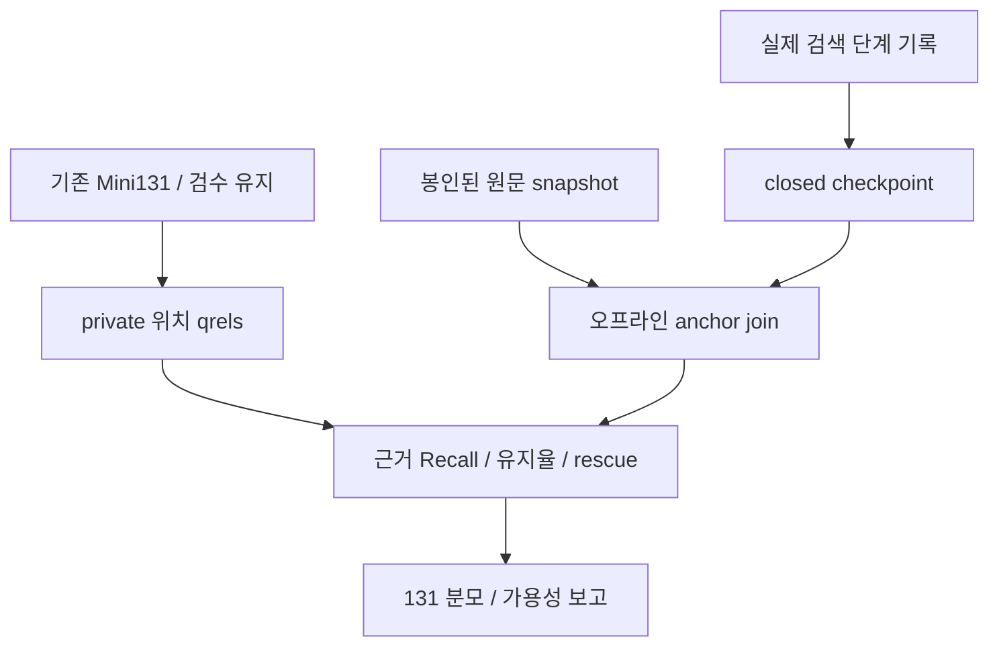
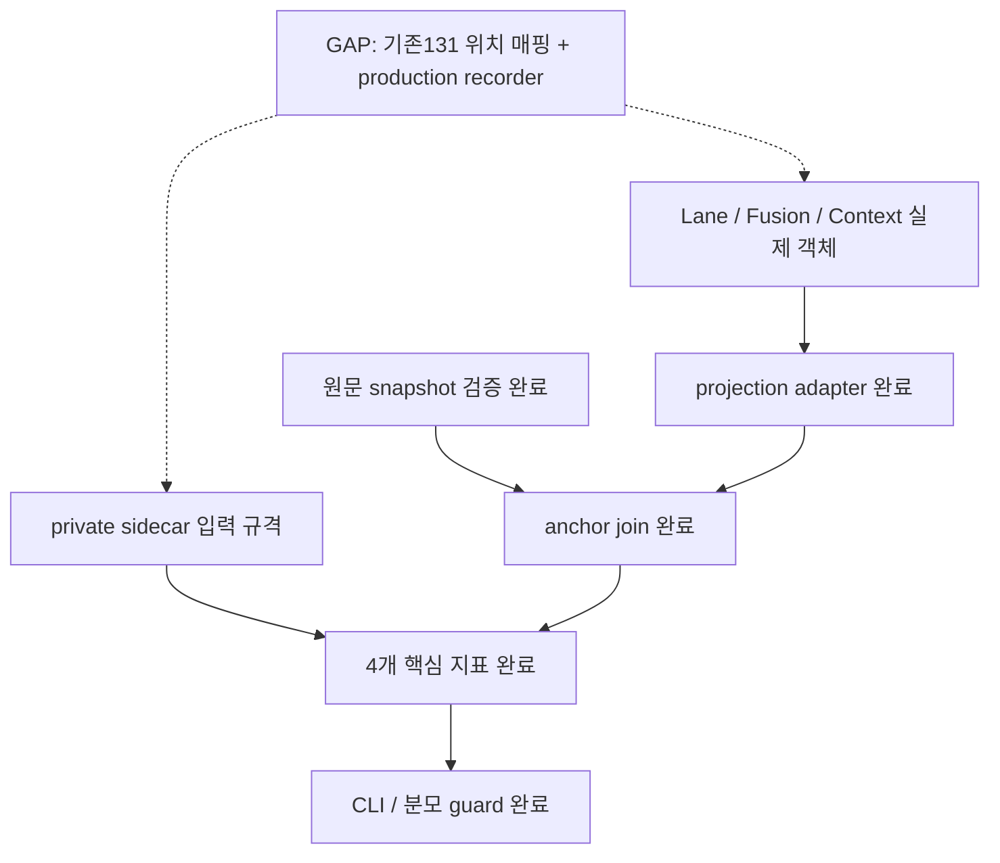

# 단계별 근거 평가 구현 — 2026-09-05

## 결과

Mini131 질문·답변은 그대로 두고 **원문 블록 기준 채점기**를 추가했다.
재랭킹 전/최종 context 필수 근거 Recall, 관련 근거 유지율, 양방향 lane rescue,
단계별 Recall@1/3/5/10을 계산한다. 모델/API 호출·기본 검색기/생성기 교체는 없었다.

| 이전 | 현재 | 아직 하지 않은 것 |
| --- | --- | --- |
| 검색 결과/답변 중심 평가 | lane/fusion/context별 같은 qrel 사후 결합 | 전체 Mini131 실제 기록 연결·실측 |
| raw 후보 유지율 | 찾은 정답 근거 중 context에 남은 비율 | 필요한 문장/구간의 완전성 |
| lexical-only 후보 개수 | 다른 검색기가 놓친 정답 근거 중 fusion 잔존분 | MRR/nDCG·slot 등 EH4.7 잔여 |
| 기록 없는 단계 해석 불명확 | 미기록/오류/결측=null+사유, 실제 빈 검색=0 | 기존 문항의 위치 qrel sidecar 완성 |

## 실행 계약

[상세 계약](../architecture/specs/stage-evaluation-v1.md).
CLI: `PYTHONPATH=src .venv/bin/python -m midprojectrag.stage_evaluation --help`.
인자: `--data-root --bundle --manifest --blocks-dir --qrels --records --output`.
입력/출력은 지정 data root의 private 하위이며 기존 파일은 덮어쓰지 않는다.
기본 Mini131 모드는 suite별 40/56/13/10/10/2 수량을 검사한다. 연결 smoke는
`--inventory-mode partial`을 명시해야 하며 보고서에 불완전으로 표시한다.
실제 qrel sidecar/단계 기록 파일은 이번에 생성하지 않았다.

실제 Lane/Fusion receipt와 ContextPack에서 ID/출처만 투영한다. 원문 locator SHA는
private snapshot에서 계산한다. 골드는 런타임 입력이 아니다. 해시 검증은 오프라인 파일 일관성이며
실제 실행 권한/실행 사실을 증명하는 장치라고 주장하지 않는다.

## 검증

- 집중 35건 및 관련 회귀를 합한 **112건 PASS**.
- 실제 private bundle: **98문서·20,118블록·98 source 파일 SHA/owner/locator 검증 PASS**.
- 파일 기반 synthetic CLI: 실제 context 선택→projection→resolver→scorer→0600 새 보고서 생성 PASS.
- 합성 Mini131 ledger 131행 유지/130행 거절, 전용 suite 텍스트 평균 제외 PASS.
- 독립 리뷰 2건. 전체 분모 누락/전용 suite 별칭 문제를 수정하고 재검토 APPROVE.
- 모델/API 호출 0회. 위 숫자는 테스트·무결성 검증 결과이며 실제 검색 품질 점수가 아니다.

```sh
PYTHONDONTWRITEBYTECODE=1 PYTHONPATH=src .venv/bin/python -m unittest \
  tests.test_stage_metrics tests.test_stage_checkpoints tests.test_stage_evaluation \
  tests.test_evidence_builder tests.test_retrieval_obligations \
  tests.test_harness_context tests.test_harness_scoring tests.evaluation.test_dataset -q
```

## Target Flow



## Current Implementation Flow



## Target vs Current Gap / 다음 우선순위

| 순서 | 대상 | 상태 | 점수 | 다음 검증 |
| --- | --- | --- | --- | --- |
| 1 | 기존131 위치 qrel/검수 lineage 재사용 | GAP · EH2.EVAL.4 | 10 | case/suite/원문 위치 누락 ledger |
| 2 | 실제 runner 단계 기록 연결 | GAP · EH4.7b | 9 | 같은 실행 chain의 전후 checkpoint |
| 3 | 같은 Mini131의 검색 비교 | 미실행 | 8 | frozen 입력·설정으로 paired run |
| 완료 | source join/핵심 지표/private CLI | 구현·집중 검증 완료 | — | 112 PASS / 실제98 source 검증 |

점수는 작업 순서다. upstream+connection+safety+validation 각0–3, risk -2–0.
1번=3+3+2+3−1, 2번=2+3+2+3−1, 3번=2+3+1+3−1.
일부 child만 검색돼도 block recall은 올라갈 수 있다. 문장 완전성·정답성 실측과 구분한다.
색상: 초록=구현·검증, 주황=private 입력, 회색=제어/설정, 빨강=남은 연결.
Mermaid 소스/PNG/HTML은 같은 basename의 형제 파일로 보관한다.

브라우저 QA: **BLOCKED**. Browser Use가 로컬 file URL을 접근 정책으로 거절했다. 다른 브라우저/서버로 우회하지 않았다.
Mermaid 2종 PNG 생성·직접 이미지 검토는 완료했지만 HTML 브라우저 렌더/스크린샷 PASS로 대체하지 않는다.
코드/CLI 검증은 완료, 보고서 브라우저 확인만 `EH4.7a.G` 잔여다. 커밋/푸시는 이번 요청에서 수행하지 않았다.
