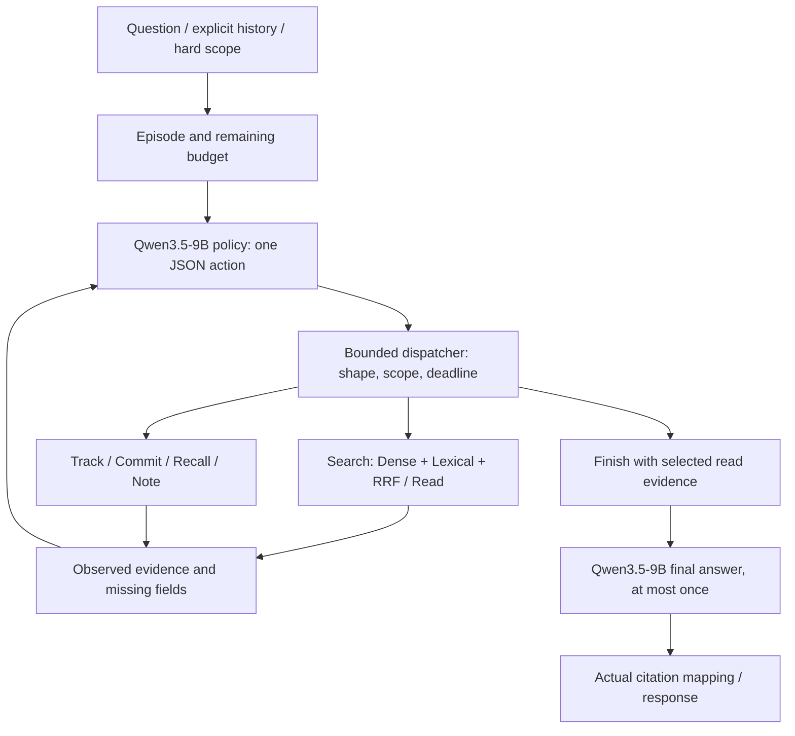
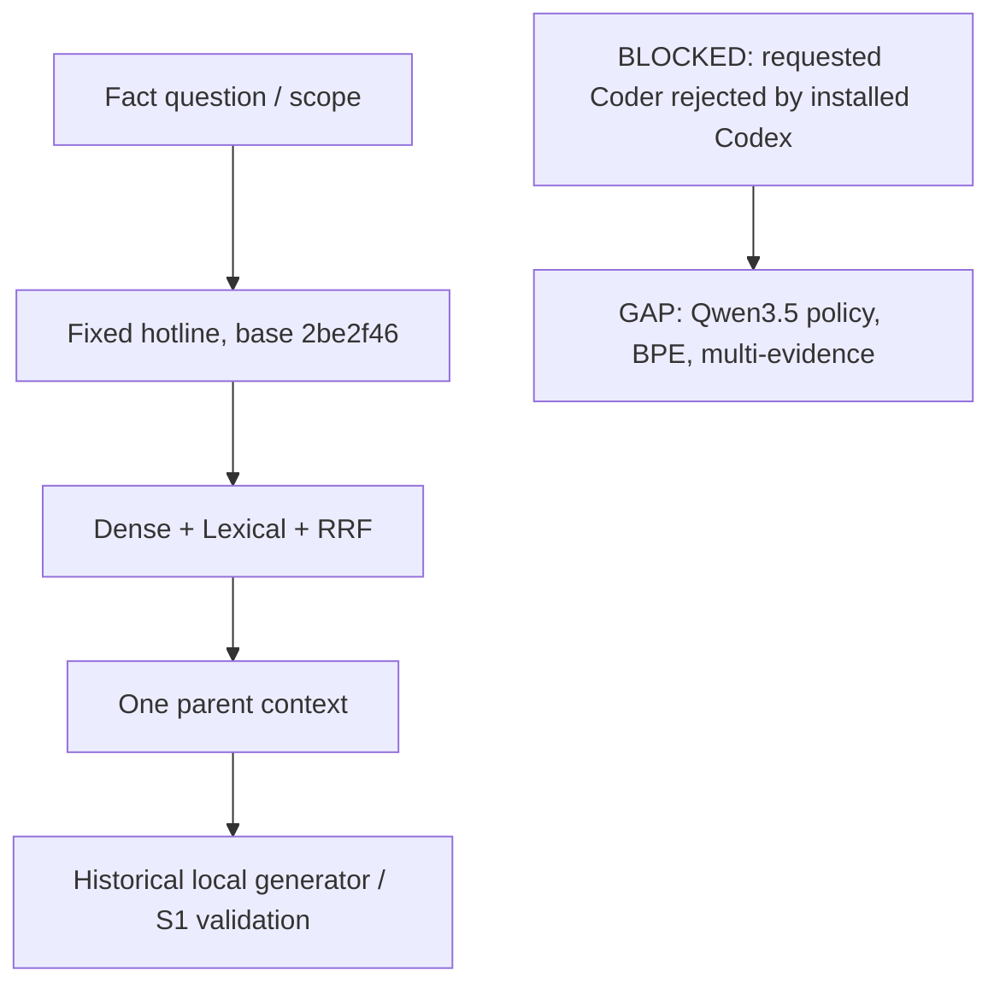

> ACTIVE CLOSEOUT: 2026-09-09-evo35-solo-delivery.md. SOLO: EVO35.1 scoped-tested; EVO35.2 artifact preflight blocked. Initial delegation sections below are historical.

# Qwen3.5-9B EvoHarness relay - 2026-09-09

Run: `evo35-hotline-20260909`; batch: `EVO35.1`.
Mode: **philosopher-coder**, selected by the requested `relay-shot` skill.
Contract: `../architecture/specs/evo-harness-qwen35-contract.md` (`evo-hotline-qwen35-v1`).
State: **BLOCKED_CODER_VERSION / STOP_WITH_REASON**. Contract written; product implementation not started.

## 0. Scope intake

- User: keep the proposed hotline-based EvoHarness plan, change the model to Qwen3.5-9B, fix the contract, proceed through relay-shot.
- Branch/base: `feat/hotline-runtime`, `2be2f4619b67bae89b6e2d522f42e9bb19ec9f95`; initially clean and tracking origin.
- Main: current Astra session, Design and coordination only. Requested Coder: `gpt-5.6-sol`/`ultra`. Requested Critic: fresh `gpt-6-astra`. No successful Coder or Critic assignment is claimed.
- Product model: `Qwen/Qwen3.5-9B` for policy and new answer profile. Collaboration models are a separate setting.
- Completion target: a real prompt-time action interface over reusable search/read/answer tools; no retired Controller lineage loop.
- Keep original integration/qwen35 worktrees, model services, private data and historical baselines unchanged.

## 1. Start report / target check

The fixed hotline is implemented and published. It remains fact-only/single-context with its historical model. No policy action loop, BPE adapter or multi-evidence Qwen3.5 profile exists on this branch. The desired policy, tool and state contracts are recorded by D-026, not asserted as implemented.

### Target flow

### Current implementation flow

## 2. Relay unit selection

Scores use the relay skill: upstream 0-4 + connection 0-3 + safety 0-2 + validation 0-2 + risk 0 to -3. These are task-selection scores, not performance scores.

| Existing task / connection | Score | Disposition |
|---|---:|---|
| EVO35.1 / HOTLINE.3: tool extraction + BPE prompt-time policy | 4+3+2+2-2 = 9 | Selected; dispatch blocked by Coder capability |
| EVO35.2: bind exact Qwen3.5 runtime and live smoke | 3+3+2+1-2 = 7 | Depends on EVO35.1 and actual model preflight |
| EVO35.3: isolated trajectory/SFT stage | 1+2+2+1-3 = 3 | Later; no usable action trajectories yet |
| EVO35.4: small GRPO | 0+2+2+1-3 = 2 | Later; requires SFT/reward/split/resource gates |

Authoritative TODO: `../architecture/todolist.md`. The new queue narrows HOTLINE.3 rather than creating a competing product backlog.

## 3. Doc / contract

COMPLETED: D-026, current requirements addendum, technical contract, authoritative TODO, this flow form and a full prepared Coder DIRECTIVE. Main Design does not issue an implementation REVIEW PASS.

## 4. Implementation

BLOCKED before dispatch. `messages/EVO35.1/001-directive.json` is prepared, not delivered to a working Coder. No new product code, configuration or tests were implemented. No model substitution or solo fallback.

## 5. Validation + report

- Product tests/live model: NOT_RUN; there is no new implementation candidate.
- Source inspection: branch/base, current hotline contract, local skills and source-model documentation inspected.
- Tool capability probe: installed `codex-cli 0.142.5`; attempted requested `gpt-5.6-sol`, `model_reasoning_effort="ultra"`, read-only, ephemeral, no tool use requested.
- Actual thread: `01a08458-34ff-7552-b617-a1d27a06effe`, capability probe only, not an implementation session.
- Server result: HTTP 400, "The 'gpt-5.6-sol' model requires a newer version of Codex. Please upgrade to the latest app or CLI and try again."
- The connector call did not return a normal exit code. Saved CLI events contain `turn.failed`; no last-message file exists. Do not assign a guessed native exit code.
- Secondary diagnostics: cache `base_instructions` schema mismatch and pre-existing skill-frontmatter warnings. These are not the primary model rejection and were not modified.
- No installed Codex.app alternative was found at the checked standard application locations; no permission bypass, version spoofing, authentication change or package upgrade was attempted.
- PNG/HTML/browser flow validation: NOT_RUN at this blocked start; no implemented workflow alignment claim.

## 6. Repair loop

NOT_ENTERED for product code. The required correction is an available supported delegation runtime for the exact collaboration models. The Coder has no product candidate for a Critic to review. No manual CLI settings, cache or authentication edits were made; automatic CLI cache refresh was not treated as immutable.

## 7. Push / publication

NOT_PERFORMED. New contract/start records are uncommitted on the hotline branch. No candidate approval, test PASS, commit or push is fabricated. The earlier branch publication at 2be2f46 remains unchanged.

## 8. Closeout report

Design/start report only. `Flow diagram verification: GAP/PARTIAL`. Missing tool/policy/BPE edges remain explicit. This is not EvoHarness-Base/SFT/RL completion, live Qwen3.5 success, or a measured speedup.

## 9. Relay shot

`STOP_WITH_REASON`: requested Coder model is rejected by installed Codex. Resume when the exact `gpt-5.6-sol`/`ultra` delegation is supported and fresh `gpt-6-astra` review is available, or the user explicitly changes the collaboration mode/models. Recheck actual branch and contract, send the existing full DIRECTIVE, then set WORK only after a real dispatch. Do not reread all historical Controller logs or restart retired Controller tasks. No background work remains running.

## 10. Final ledger

Doc: written. Implementation: blocked before dispatch. Product validation: not run. Repair: delegation prerequisite only. Push: not performed. Report: design/gap record. Relay: STOP_WITH_REASON. Next: EVO35.1 over the saved contract. SFT/GRPO and private live runs remain later gates.

## Solo re-entry - current active flow

0. Scope Intake: COMPLETED. Mode solo by explicit latest user request; branch feat/hotline-runtime; Qwen3.5-9B unchanged.
1. Start Report: COMPLETED. Reuse above target/current design and score table; base 2be2f46. Current gap is real policy/tool/BPE wiring.
2. Relay Unit Selection: COMPLETED. EVO35.1 score9 chosen; EVO35.2 score7 next. Historical Coder blocker superseded, no agent calls.
3. Doc/Contract: COMPLETED. D-026 solo amendment; direct public hybrid/search/read adapter and explicit follow-up clarification.
4. Implementation: IN_PROGRESS, sequential state/tool/policy/runner then runtime composition. Small package, no legacy Controller modifications.
5. Validation/Report: pending focused + public API integration + CLI + flow PNG/HTML; real-model test separate.
6. Repair: apply only evidenced scoped fixes, preserve failures.
7. Publication: selective new/authorized docs and source after tests, existing hotline branch; no unrelated changes.
8. Closeout: update target/current and measured/unsupported boundary.
9. Relay: CONTINUE_WITH_NEXT_FORM into available EVO35.2 preflight after EVO35.1 closure.
10. Final Ledger: active; no implementation/full/live/training success asserted yet.
